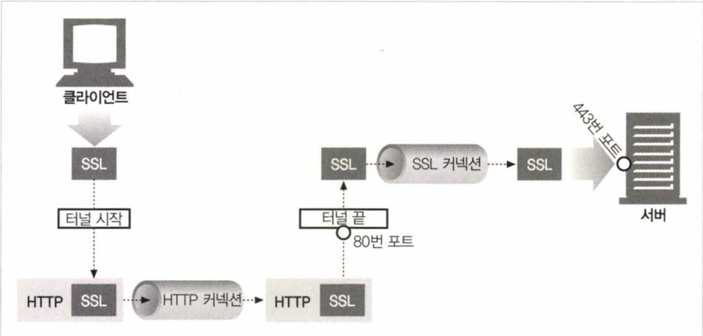

# HTTP 개관

# 웹 서버

웹 서버는 HTTP 프로토콜로 의사소통하기 때문에 보통 HTTP 서버라고 한다. 이들 웹 서버는 인터넷의 데이터를 저장하고, HTTP 클라이언트가 요청한 데이터를 제공한다

# 웹 클라이언트

웹 클라이언트는 HTTP 프로토콜로 서버에 요청을 보내고, 서버로부터 응답을 받는다. 웹 브라우저(Chrome, Edge 등)는 가장 흔한 웹 클라이언트이다.

# 리소스

웹 서버는 웹 리소스를 관리하고 제공한다. 리소스는 정적 파일(HTML, 이미지, 동영상, ...)과 동적 콘텐츠(웹페이지의 내용, 사용자의 입력에 따라 변하는 콘텐츠, ...)로
구분된다.

> 위 사진에 나온 부분 중 파일시스템 에 해당 하는 부분이 정적 리소스이며, 웹캠 게이트 웨이, 주식거리 게이트 웨이 등 다른 서버에 해당하는 부분이 동적 리소스이다.

요약하자면 어떤 종류의 컨텐츠도 웹 리소스가 될 수 있다. 웹 리소스는 웹 서버에 존재하며, 웹 리소스는 URI(Uniform Resource Identifier)로 식별된다.

## 미디어 타입

인터넷에서는 수천 가지의 데이터를 다루기 때문에 종류도 굉장이 다양하다. HTTP에서는 웹에서 전송되는 객체에 MIME(Multipurpose Internet Mail
Extensions, 다목적 인터넷 메일 확장) 타입이라는 데이터 포맷 라벨을 붙인다.
> 원래 각기 다른 전자메일 시스템이 서로 다른 형식으로 데이터를 주고받을 수 있도록 만들어진 것이지만, 이메일에서 워낙 잘 동작했기 때문에 HTTP에서도 멀티 미디어 콘텐츠를
> 기술하고 라벨을 붙이기 위해 채택되었다.

MIME 타입은 주 타입/부 타입의 ASCII 문자열로 이루어진 문자열이다. MIME 타입은 서버가 클라이언트에게 전송하는 객체의 미디어 타입을 알려주기 위해 사용된다.

예를 들어 잘 알려진 MIME 타입은 다음과 같다.

| MIME 타입                | 설명       |
|------------------------|----------|
| **`text/html`**        | HTML 문서  |
| `text/plain`           | 플레인 텍스트  |
| **`image/jpeg`**       | JPEG 이미지 |
| `image/gif`            | GIF 이미지  |
| `audio/mpeg`           | MP3 오디오  |
| `video/mp4`            | MP4 비디오  |
| `application/pdf`      | PDF 문서   |
| **`application/json`** | JSON 데이터 |
| `application/xml`      | XML 데이터  |

# URI(Uniform Resource Identifier)

URI는 인터넷의 자원을 나타내는 유일한 주소이다. URI는 인터넷의 우편물 주소 같은 것으로, 정보 리소스를 고유하게 식별하고 위치를 지정할 수 있다.

URI는 URL과 URN으로 나뉜다.

- **URL**(Uniform Resource Locator): 리소스 식별자의 가장 흔한 형태로, 리소스가 어디 있는지를 알려준다.
- **URN**(Uniform Resource Name): 콘텐츠를 이루는 한 리소스에 대해, 그 리소스의 위치에 영향받지 않는 유일무이한 이름 역할을 한다.
    - 아직 실험 중인 상태고, 아직 널리 채택되지 않았다.

URI는 URL과 URN을 포함하는 개념이다. URL은 URI의 일종이다. URI는 URL과 URN을 포함하는 개념이다.

# 트렌젝션

HTTP 트렌젝션은 클라리언트에서 서버로 보내는 요청 명령과, 서버에서 클라이언트로 보내는 응답 결과로 구성된다.

## 메서드

HTTP 메서드는 클라이언트가 서버에게 수행해 달라고 요청하는 동작이다. 모든 HTTP 요청 메시지는 하나의 메서드를 갖는다. 메서드는 서버가 수행해야 할 동작을 나타낸다.

| 메서드    | 설명                                     |
|--------|----------------------------------------|
| GET    | 서버에서 클라이언트로 지정한 리소스를 보내라.              |
| POST   | 클라이언트 데이터를 서버 게이트웨이 어플리케이션으로 보내라.      |
| PUT    | 클라이언트에서 서버로 보낸 데이터를 지정한 이름의 리소스로 저장하라. |
| DELETE | 서버에서 클라이언트로 지정한 리소스를 삭제하라.             |
| HEAD   | GET 메서드와 동일하지만, 서버는 HTTP 헤더 부분만 보내라.   |

## 상태 코드

모든 HTTP 응답 메세지는 상태 코드와 함께 반환된다. 상태코드는 클라이언트에게 요청이 성공했는지, 아니면 추가 조치가 필요한지 알려주는 세 자리 숫자이다.

아래는 흔히 쓰이는 상태코드이다.

| 상태 코드 | 메시지                   | 설명                      |
|-------|-----------------------|-------------------------|
| 200   | OK                    | 정상 처리                   |
| 302   | Found                 | 리소스가 다른 위치에 있을 때        |
| 404   | Not Found             | 서버에서 요청한 리소스를 찾을 수 없을 때 |
| 500   | Internal Server Error | 서버에 문제가 있을 때            |

## 웹페이지의 트렌젝션

웹 페이지는 하나의 작업을 하기 위해 여러 HTTP 의 트렌젝션을 수행한다.
예를 들면 다음과 같은 순서로 하나의 페이지를 구성하기 위한 많은 트렌젝션이 수행될 수 있다.

1. HTML 페이지를 받는다.
2. HTML 내부에 있는 이미지, 스크립트, 스타일시트 등을 받는다.
3. 스크립트 내에서 추가적으로 리소스를 서버에 요청한다.

이처럼 웹 페이지는 여러 리소스로 구성되어 있고, 이 리소스들은 각각의 트렌젝션으로 처리된다.

따라서 웹 페이지는 보통 하나의 리소스가 아닌, **리소스의 모음**이다.

# 메시지

HTTP 메시지는 서버와 클라이언트 간에 교환되는 정보의 블록이다. 메시지는 단순한 줄 단위의 텍스트로 이루어진다.

HTTP 메시지는 다음의 세 부분으로 이루어진다.

- 시작줄: 메시지의 시작을 알리는 줄로, 요청 메시지에는 요청 메서드, 요청 URI, HTTP 버전이 포함되고, 응답 메시지에는 HTTP 버전, 상태 코드, 상태 메시지가
  포함된다.
- 헤더: 시작줄 다음에는 0개 이상의 헤더 필드가 올 수 있다. 각 헤더 필드는 이름과 값으로 이루어진다. 쉬운 구문 분석을 위해 콜론(:)으로 구분된다.
- 본문: 헤더 다음에는 본문이 올 수 있다. 본문은 메시지에 포함된 데이터를 포함한다. 구조적인 시작줄이나, 헤더와는 달리 본문은 임의의 이진데이터(비디오, 오디오 트렉, 응용
  소프트 웨어 등)를 포함할 수 있다.

# TCP 커넥션

TCP(Transmission Control Protocol)는 HTTP의 기반이 되는 프로토콜이다. 위에서 살펴 보았던 HTTP 트렌젝션은 TCP 커넥션을 통해 이루어진다.

## TCP/IP

TCP/IP는 네트워크 통신을 위한 규칙들의 집합이다. HTTP는 네트워크 통신의 핵심적인 세부 사항에 대해서는 신경쓰지 않는다. 대신 신뢰성 있는 인터넷 전송 프로토콜인
TCP/IP에 의존한다.

TCP는 다음의 특징을 가진다.

1. 오류 없는 데이터 전송
2. 순서에 맞는 전달
3. 조각나지 않는 데이터 스트림

일단 TCP 커넥션이 맺어지면, 클라이언트와 서버 컴퓨터 간에 교환되는 메시지가 없어지거나, 손상되거나, 순서가 뒤바뀌어 수신되는 일은 결코 없다.

HTTP 는 다음 그림과 같이 TCP/IP 위에서 동작한다.

## 접속, IP 주소, 포트 번호

TCP/IP 네트워크에서 컴퓨터는 IP 주소와 포트 번호로 식별된다. IP 주소는 컴퓨터를 식별하고, 포트 번호는 컴퓨터에서 실행 중인 프로그램을 식별한다.

예를 들어, `http://www.example.com:80` 에서 `www.example.com`은 IP 주소를 나타내고, `80`은 포트 번호를 나타낸다.
여기서 `example.com`은 도메인 이름이며, DNS(Domain Name System)을 통해 IP 주소로 변환된다.

그러나 흔히 아는 `http://www.naver.com`과 같은 경우 포트 번호를 명시하지 않는데, 이는 HTTP 프로토콜의 기본 포트 번호가 80이기 때문이다.
비슷한 이유로 `https://www.naver.com` 같은 경우에는 같은 이유로 HTTPS 프로토콜의 기본 포트 번호가 443이기 때문에 포트 번호를 명시하지 않는다.

일반적으로 원격지에 있는 서버에 리소스를 가져오기 위해서는 웹 브라우저가 다음과 같은 과정을 거친다.

1. 서버의 URL에서 호스트 이름을 추출한다.
2. 호스트 이름을 IP 주소로 변환한다.
3. URL에서 포트번호가 명시되어 있으면, 포트 번호를 추출한다.
4. TCP 커넥션을 열고, 서버의 IP 주소와 포트 번호로 커넥션을 맺는다.
5. HTTP 요청을 서버로 보낸다.
6. 서버로부터 HTTP 응답을 받는다.
7. 커넥션을 닫는다.
8. 웹 브라우저는 응답을 화면에 표시한다.

# 프로토콜 버전

오늘날 쓰이고 있는 HTTP 버전은 여러가지이다.

| 버전            | 채택 연도 | 설명                                                                                                                                                         |
|---------------|-------|------------------------------------------------------------------------------------------------------------------------------------------------------------|
| **HTTP/0.9**  | 1991년 | GET 메서드만 지원한다.  (원래 간단한 HTML 객체를 받아오기 위해 만들어졌다. HTTP/0.9는 금방 HTTP/1.0으로 대체되었다.)                                                                         |
| **HTTP/1.0**  | 1996년 | GET, HEAD, POST 메서드를 지원한다. HTTP 헤더, 멀티미디어 객체 처리를 추가했다.  (월드 와이드 웹을 대세로 만든 버전이나, 결코 잘 정의된 명세가 아니다. HTTP가 상업적, 학술적으로 성장하던 시기에 만들어진, 잘 동작하는 용례들의 모음에 가깝다.) |
| **HTTP/1.0+** | 1997년 | HTTP/1.0에 오래 지속되는 "keep-alive" 커넥션, 가상 호스팅, 프락시 연결, 상태 코드, 헤더 확장, 캐시 지원 등을 추가했다.  (HTTP/1.0의 확장판이다.)                                                    | 
| **HTTP/1.1**  | 1999년 | HTTP/1.0의 문제점을 해결하고, 성능을 개선하였다.  (현재까지 가장 많이 쓰이는 HTTP 버전이다.)                                                                                            |
| **HTTP/2.0**  | 2015년 | HTTP/1.1의 성능을 개선하기 위해 구글의 SPDY 프로토콜을 기반으로 만들어졌다.                                                                                                           |

# 웹의 구성요소

## 프락시
클라이언트와 서버 사이에 위치한 HTTP 중개자로, 클라이언트의 모든 HTTP 요청을 받아 서버에 전달하고, 서버의 모든 HTTP 응답을 받아 클라이언트에 전달한다.

일반적으로는 주로 보안을 위해 사용된다. 예를 들어 회사에서 무엇인가 다운 받았을 때 바이러스를 검출하거나, 초등학교 학생들에게서 성인 콘텐츠를 차단할 수 있다.

## 캐시
캐시는 자주 찾는 웹 페이지의 사본을 저장해 두는 것이다. 캐시는 빠른 접근을 위해 사용된다.

웹 캐시와 캐시 프락시는 자신을 거처가는 문서들 중 자주 찾은 것의 사본을 저장해두는, 특별한 종류의 프락시 서버이다. 다음 번에도 클라이언트가 동일한 문서를 요청하면, 그 캐시가 갖고 있는 사본을 받을 수 있다.

## 게이트웨이

게이트웨이는 다른 애플리케이션과 연결되는 특별한 서버이다. 게이트웨이는 클라이언트가 다른 유형의 서버와 통신할 수 있도록 해준다.
게이트웨이는 언제나 스스로가 리소스를 갖고 있는 진짜 서버인 것처럼 요청을 다룬다. 클라이언트 입장에서는 자신이 게이트 웨이와 통신하고 있음을 알아채지 못할 것이다.

주로 HTTP 트래픽을 다른 프로토콜로 변환하기 위해 사용되며 아래의 예시는 HTTP 요청을 받아들인 뒤 FTP 서버로 전달한 후 다시 FTP 응답을 HTTP 응답으로 변환하여 클라이언트에게 전달하는 예이다.

## 터널
터널은 두 커넥션 사이에서 Raw데이터를 열어보지 않고 그대로 전달해주는 HTTP 어플리케이션이다. 

주로 비 HTTP 데이터를 하나 이상의 HTTP 연결을 통해 그대로 전송해주기 위해 사용된다.

대표적으로 HTTP 터널을 사용하는 예로 HTTPS가 있다. HTTPS는 HTTP를 사용하는데, HTTP는 평문으로 통신하기 때문에 보안상 문제가 있다. 따라서 HTTPS는 암호화된 SSL 트래픽을 HTTP 커넥션으로 전송함으로써 보안을 유지한다.

## 에이전트
사용자를 위해 HTTP 요청을 만들어주는 클라이언트 프로그램이다. 웹 요청을 만드는 애플리케이션은 뭐든 에이전트이다.

대표적인 에이전트로는 웹 브라우저가 있다. 또한 사람의 통제 없이 스스로 웹을 돌아다니며 HTTP 트렌젝션을 일으키는 자동화된 에이전트는 보통 웹 로봇이나 스파이더라고 불린다.

