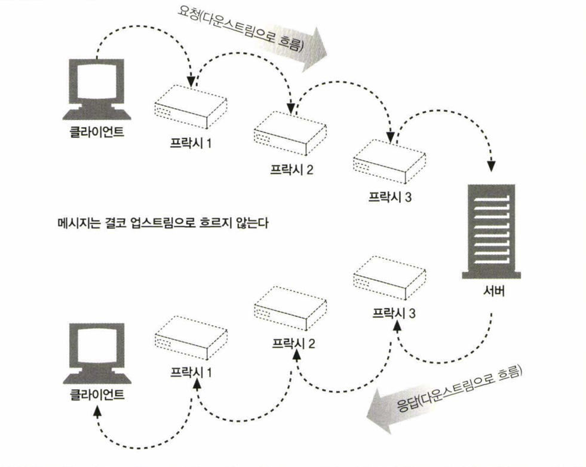

# 메시지의 흐름

HTIP 메시지는 HTTP 애플리케이션 간에 주고받은 데이터의 블록이다.

메시지의 내용과 의미를 설명하는 텍스트 메타 정보로 시작하고 그 다음에 선택적으로 데이터가 올 수 있다.

메시지는 클라이언트, 서버, 프락시 사이를 흐른다. ‘인바운드’, ‘아웃바운드’, ‘업스트림’, ‘다운스트림은 메시지의 방향을 의미하는 용어이다.

## 인바운드와 아웃바운드

H#TTP는 인바운드와 아웃바운드라는 용어를 트렌젝션 방향을 표현하기 위해 사용한다.

**인바운드**: 메시지가 서버로 향하는 것
**아웃바운드**: 메시지가 클라이언트로 돌아오는 것


## 다운스트림

모든 HTTP 트렌젝션은 다운스트림 방향으로 이루어진다. 메시지의 발송자는 수신자의 업스트림이다.

이는 메시지는 다시 거슬러서 돌아오지 않는다는 것을 의미하며, 그림으로 이해하면 더 쉽다.



# 메시지의 각 부분

메시지는 단순한 구조화된 데이터의 불록이며, 세 부분으로 이루어진다.

시작줄은 이것이 어떤 메시지인지 서술하며, 헤더 블록은 속성을, 본문은 데이터를 담고 있다 본문은 아예 없을 수도 있다.


시작줄과 헤더는 그냥 줄 단위로 분리된 아스키 문자열이다.
각 줄은 캐리지 리턴(ASCII 13)과 개행 문자(ASCII 10)로 구성된 두 글자의 줄바꿈 문자열으로 끝난다.
(줄바꿈 문자열은 'CRLF' 라고 쓴다. HTTP 명세에 따른다면 줄바꿈 문자열은 'CRLF' 이지만 견고한 애플리케이션이라면 그냥 개행 문자도 받아들일 수 있어야 한다)

## 메시지 문법

모든 메시지는 요청 메시지나 응답 메시지로 분류된다.

아래는 요청과 응답의 예시로 좀 더 구조화된 도표를 보여준다.


요청 메시지의 형식은 다음과 같다.

```
<메서드> <요청 URL> <버전>
<헤더>

<엔터티 본문>
```

응답 메시지의 형식은 다음과 같다. (시작절에서만 문법이 다르다)

```
<버전> <상태코드> <사유 구절>
<헤더>

<엔터티 본문>
```

# 메서드

클라이언트 측에서 서버가 리소스에 대해 수행해주길 바라는 동작이다.
`GET`, `POST`, `HEAD`와 같이 한 단어로 되어있다.

## GET

가장 흔히 사용되는 메서드로 주로 서버에게 리소스를 달라고 요청하기 위해 사용된다.
> HTTP/1.1은 서버가 이 메서드를 구현할 것을 요구한다.


## HEAD

HEAD 메서드는 정확히 GET처럼 행동하지만, 서버는 응답으로 헤더만을 돌려준다. 결코 본문을 돌려주지 않는다.

이는 클라이언트가 리소스를 실제로 가져올 필요 없이 헤더만을 조사할 수 있도록 해준다.

이는 다음 상황에서 주로 사용된다

1. 리소스를 가져오지 않고도 그에 대해 무엇인가(타입 등)를 알아낼 수 있다.
2. 응답의 상태 코드를 통해, 개체가 존재하는지 확인할 수 있다.
3. 헤더를 확인하여 리소스가 변경되었는지 검사할 수 있다.


## PUT

PUT 메서드는 클라이언트가 서버로 데이터를 보내는 메서드이다. 서버는 이 데이터를 지정한 이름의 리소스로 저장한다.

서버가 요청의 본문을 가지고요청 URL의 이름대로 새 문서를 만들거나, 이미 URL이 존재한다면 본문을 사용해서 교체하는 것이다.


### POST

POST 메서드는 클라이언트가 서버로 데이터를 보내는 메서드이다.

실제로 HTML 폼을 지원하기 위해 흔히 사용되며, 채워진 폼에 담긴 데이터는 서버로 전송되며, 서버는 이를 모아서 필요로 하는 곳(데이터베이스 등)에 저장한다.

흔히 자원을 생성하는 메서드로 알고 있는데, 이는 POST 메서드가 서버에게 새로운 데이터를 보내는 것이기 때문이다.

## TRACE

클라이언트가 어떤 요청을 할 때, 그 요청은 방화벽, 프락시, 게이트웨이 둥의 애플리케이션을 통과할 수 있다.

TRACE 메서드는 클라이언트에게 자신의 요청이 서버에 도달했을 때 어떻게 보이게 되는지 알려준다.

TRACE 요청은 목적지 서버에서 '루프백(loopback)' 진단을 시작한다. 요청 전송의 마지막 단계에 있는 서버는 자신이 받은 요청 메시지를 본문에 넣어 TRACE 웅답을
되돌려준다.

클라이언트는 자신과 목적지 서버 사이에 있는 모든 HTTP 애플리케이션의 요청/응답 연쇄를 따라가면서 자신이 보낸 메시지가 망가졌거나 수정되었는지, 만약 그렇다면 어떻게
변경되었는지 확인할 수 있다.

주로 진달을 위해 사용된다. 예를 들면 요청이 의도한 요청/옹답 연쇄를 거쳐가는지 검사할 수 있다. 또한 프락시나 다른 애플리케이션들이 요청에 어떤 영향을 미치는지 확인해보고자 할
때도 좋은 도구다.
> 다른 종류의 요청 (GET, HEAD, POST 둥 각각 다른 메서 드를 사용한)들을 일관되게 다룬다고 가정하는 문제가 있다. 많은 HTTP 애플리케이션은 메서드에 따라 다르게
> 동작한다 예를 들어, 프락시는 POST 요청을 바로 서버로 통과시키는 반면 GET 요청은 웹 캐시와 같은 다른 HTTP 애플리케이션으로 전송한다. TRACE는 메서드 룰
> 구별하는
> 메커니즘울 제공하지 않는다. 어떻게 TRACE 요청을 처리할 것인지에 대해서는 일반적으로 중간 애플리케이션이 결정을 내린다.


## OPTIONS

OPTIONS 메서드는 웹 서버에게 여러 가지 종류의 지원 범위에 대해 물어본다. 서버에게 특정 리소스에 대해 어떤 메서드가 지원되는지 물어볼 수 있다


## DELETE

DELETE 메서드는 서버에게 지정한 리소스를 삭제하라고 요청한다. 그러나 클라이언트는 삭제가 수행되는 것을 보장 하지 못한다. 왜냐하면 HTTP 명세는 서버가 클라이언트에게
알리지 않고 요청을 무시하는 것을 허용하기 때문이다.


## 확장 메서드

HTTP는 필요에 따라 확장에도 문제가 없도록 설계되어 있으므로, 새로 기능을 추가해도 과거에 구현된 소프트웨어들의 오동작을 유발하지 않는다.

확장 메서드는 HTTP/1.1에 정의되지 않은 메서드로 개발자에게 그들의 서버가 구현한 HTTP 서비스의 서버가 관리하는 리소스에 대한 능력을 확장하는 수단을 제공한다.

| 메서드     | 설명                                                                                |
|---------|-----------------------------------------------------------------------------------|
| `LOCK`  | 사용자가 리소스를 잠글 수 있게 해준다. 예를 들어, 문서를 편집하는 동안 다른 사람이 동시에 같은 문서를 편집하지 못하도록 문서를 잠글 수 있다 |
| `MKCOL` | 사용자가 문서를 생성할 수 있게 해준다                                                             |
| `COPY`  | 서버에 있는 리소스를 복사한다                                                                  |
| `MOVE`  | 서버에 있는 리소스를 이동한다                                                                  |

모든 확장 메서드가 형식을 갖춘 명세로 정의된 것은 아니라는 점에 주의해야 한다. 만약 당신이 어떤 확장 메서드를 정의한다면, 그것은 대부분의 HITP 애플리케이션이 이해할 수
없을 것이다.
마찬가지로, 당신의 HTTP 애플리케이션이 이해할 수 없는 확장 메서드를 사용하는 애플리케이션과 마주칠 수도 있다.

이런 상황에서는 확장 메서드에 대해 관용적안 것이 최고다. 프락시는, 종단 간 (end-to-end) 행위를 망가뜨리지 않을 수 있다면, 알려지지 않은 메서드가 담긴 메시지를
다운스트림 서버로 전달하려고 시도한다. 그렇지 않다면 프락시는 501 Not Implemented 상태 코드로 웅답해야 한다 확장 메서드(그리고 대부분의 HTTP 확장)를 다룰
때는 "엄격하게 보내고 관대하게 받아들여라" 라는 오랜 규칙에 따르는 것이 가장 좋다.
> Postel의 법칙이라고도 한다. 이 법칙은 네트워크 프로토콜이나 데이터 형식을 구현할 때, 엄격하게 보내고 관대하게 받아들이는 것이 좋다는 원칙이다.

## 안전한 메서드

HTTP는 안전한 메서드라 불리는 메서드의 집합을 정의한다. `GET`과 `HEAD`는 안전한 메서드라고 할 수 있는데, 이는 서버의 상태를 변경하지 않는다는 것을 의미한다.

# 요청 URL

요청하는 리소스의 위치를 가리킨다. 절대 URL이나 상대 URL이 올 수 있다.

# 버전

메시지에서 사용 중인 HTTP의 버전이다. 형식은 다음과 같다.

```
HTTP/<메이저 버전>.<마이너 버전>
```

# 상태 코드

요청 중에 무엇이 일어났는지 설명하는 세 자리 숫자이다.
예를 들어, `200`은 성공을 의미하고, `404`는 찾을 수 없음을 의미한다.

## 정보성 상태 코드(100-199)

정보성 상태코드는 HTTP/1.1에서 도입되었다. 이 상태 코드는 클라이언트에게 요청을 계속 진행할 것인지, 서버가 요청을 받았는지, 서버가 요청을 처리하고 있는지 등을 알려준다.
> 이들은 비교적 새로운 것이며, 복잡함을 감수할 만한 가치가 있는지에 대해 논란이 되고 있다.

| 상태 코드 | 메시지                 | 설명                                                                                      |
|-------|---------------------|-----------------------------------------------------------------------------------------|
| 100   | Continue            | 요청의 시작 부분 일부가 받아들여졌으며, 클라이언트는 나머지를 계속 이어서 보내야 함을 의마한다. 이것을 보낸 후, 서버는 반드시 요청을 받아 응답해야한다. |
| 101   | Switching Protocols | 클라이언트가 Upgrade 헤더에 나열한 것 중 하나로 서버가 프로토콜을 바꾸었음을 의미한다                                     |

### 100 Continue

- 클라이언트 애플리케이션 은 100-continue를 서버가 다루거나 사용할 수 없는 큰 엔터티를 서버에게 보내지 않으려는 목적으로만 사용해야한다.

## 성공 상태 코드(200-299)

서버는 대응하는 성공을 의미히는 상태 코드의 배열을 갖고 있으며, 각각 다른 종류의 요청에 대응한다.

| 상태 코드 | 메시지                           | 설명                                                                                                                                                                                                           |
|-------|-------------------------------|--------------------------------------------------------------------------------------------------------------------------------------------------------------------------------------------------------------|
| 200   | OK                            | 요청은 정상이고, 엔터티 본문은 요청된 리소스를 포함하고 있다.                                                                                                                                                                          |
| 201   | Created                       | 서버 개체를 생성하라는 요청(예: PUT)을 위한 것. 응답은, 생성된 리소스에 대한 최대한 구체적인 참조가 담긴 Location 헤더와 함께, 그 리소스를 참조할 수 있는 여러 URL을 엔터티 본문에 포함해야 한다.                                                                                    |
| 202   | Accepted                      | 요청은 받아들여졌으나 서버는 아직 그에 대한 어떤 동작도 수행하지 않았다. 서버가 요청의 처리를 완료할 것인지에 대한 어떤 보장도 없다. 이것은 단지 요청이 받아들이기에 적법해 보인다는 의미일 뿐이다. 서버는 엔터티 본문에 요청에 대한 상태와 가급적이면 요청의 처리가 언제 완료될 것인지 에 대한 추정(혹은 그에 대한 정보를 어디서 얻을 수 있는지)도 포함해야 한다 |
| 203   | Non-Authoritative Information | 엔터티 헤더에 들어있는 정보가 원래 서버가 아닌 리소스의 사본에서 왔다. 중개자가 리소스의 사본을 갖고 있었지만 리소스에 대한 메타 정보(헤더)를 검증하지 못한(혹은 안 한) 경우 아런 일이 발생 할수 있다                                                                                          |
| 204   | No Content                    | 응답 메시지는 헤더와 상태줄을 포함하지만 엔터티 본문은 포함하지 않는다. 주로 웹브라우저를 새 문서로 이동시키지 않고 갱신하고자 할 때(예: 폼을 리프레시) 사용한다                                                                                                                 |
| 205   | Reset Content                 | 주로 브라우저를 위해 사용되는 또 하나의 코드. 브라우저에게 현재 페이지에 있는 HTML 폼에 채워진 모든 값을 비우라고 말한다                                                                                                                                      |
| 206   | Partial Content               | 부분 혹은 범위 요청이 성공했다는 것을 의미한다.                                                                                                                                                                                  |

## 리다이렉션 상태 코드(300-399)

리다이렉션 상태 코드는 클라이언트가 관심 있어 하는 리소스에 대해 다른 위치를 사용하라고 말해주거나 그 리소스의 내용 대신 다른 대안 웅답을 제공한다.


| 상태 코드 | 메시지                | 설명                                                                                                        |
|-------|--------------------|-----------------------------------------------------------------------------------------------------------|
| 300   | Multiple Choices   | 클라이언트가 여러 리소스를 가리키는 URL을 가지고 있을 때 사용된다.                                                                   |
| 301   | Moved Permanently  | 리소스가 새 위치로 옮겨졌다. 이것은 리소스가 영구적으로 새 위치로 옮겨졌다는 것을 의미한다. 클라이언트는 이후의 요청을 새 위치로 보내야 한다.                         |
| 302   | Found              | 리소스가 다른 위치에 있을 때 사용된다. 이것은 리소스가 일시적으로 다른 위치에 있을 뿐이며, 클라이언트는 이후의 요청을 원래 위치로 보내야 한다.                        |
| 303   | See Other          | 클라이언트가 다른 URL로 요청을 보내야 할 때 사용된다. 이것은 리소스가 다른 위치에 있을 뿐이며, 클라이언트는 이후의 요청을 새 위치로 보내야 한다.                     |
| 304   | Not Modified       | 클라이언트가 캐시된 버전의 리소스를 요청했을 때 사용된다. 이것은 클라이언트가 캐시된 버전을 사용할 수 있다는 것을 의미한다.                                    |
| 305   | Use Proxy          | 리소스가 반드시 프락시를 통해서 접근되어야 함을 나타내기 위해 사용한 댜 프락시의 위치는 Location 헤더를 통해 주어진다                                    |
| 306   | (Unused)           | 이 상태 코드는 HTTP/1.1 명세에서 예약되어 있지만 사용되지 않는다.                                                                 |
| 307   | Temporary Redirect | 301 상태 코드와 비슷하다 그러나 클라이언트는 Location 헤더로 주어진 URL을 리소스를 임시로 가리키기 위한 목적으로 사용해야 한다. 이후의 요청에서는 원래 URL을 사용해야 한다 |

## 클라이언트 에러 상태 코드(400-499)

클라이언트 에러 상태 코드는 클라이언트가 잘못된 요청을 보냈을 때 사용된다. 이는 서버가 요청을 처리할 수 없다는 것을 의미한다.

| 상태 코드 | 메시지                           | 설명                                                                                                                                      |
|-------|-------------------------------|-----------------------------------------------------------------------------------------------------------------------------------------|
| 400   | Bad Request                   | 요청이 잘못되었다. 서버가 요청을 이해하지 못했거나, 요청이 잘못되었거나, 서버가 요청을 처리할 수 없다는 것을 의미한다.                                                                    |
| 401   | Unauthorized                  | 리소스를 얻기 전에 클라이언트에게 스스로를 인증하라고 요구하는 내용의 응답을 적절한 헤더와 함께 반환한다.                                                                             |
| 402   | Payment Required              | 이 상태 코드는 예약되어 있지만 사용되지 않는다.                                                                                                             |
| 403   | Forbidden                     | 요청이 서버에 의해 거부되었음을 알려주기 위해 사용한다. 만약 서버가 왜 요청이 거부되었는지 알려주고자 한다면, 서버는 그 이유를 설명하는 엔터티 본문을 포함시킬 수 있다. 그러나 이 코드는 보통 서버가 거절의 이유를 숨기고 싶을 때 사용한다 |
| 404   | Not Found                     | 서버가 요청한 리소스를 찾을 수 없다는 것을 의미한다.                                                                                                          |
| 405   | Method Not Allowed            | 요청한 URL에 대해, 지원하지 않는 메서드로 요청 받았을 때 사용한다. 요청한 리소스에 대해 어떤 메서드가 사용 가능한지 클라이언트에게 알려주기 위해, 요청에 Allow 헤더가 포함되어야 한다.                           |
| 406   | Not Acceptable                | 클라이언트는 자신이 어떤 종류의 엔터티를 받아들아고자 하는지에 대해 매개변수로 명시할 수 있다. 이 코드는 주어진 URL에 대한 리소스 중 클라이언트가 받아들일 수 있는 것이 없는 경우 사용한다.                           |
| 407   | Proxy Authentication Required | 401 상태 코드와 같으나, 리소스에 대해 인증을 요구하는 프락시 서버를 위해 사용한다                                                                                        |
| 408   | Request Timeout               | 서버가 요청을 처리하는 데 너무 오래 걸렸을 때 사용한다.                                                                                                        |
| 409   | Conflict                      | 요청이 리소스에 대해 일으킬 수 있는 몇몇 충돌을 지칭하기 위해 사용한다. 서버는 요청이 충돌을 일으킬 염려가 있다고 생각될 때 이 요청을 보낼 수 있다. 응답은 충돌에 대해 설명하는 본문을 포함해야 한다.                     |

## 서버 에러 상태 코드(500-599)

서버 에러 상태 코드는 서버가 요청을 처리하는 동안 문제가 발생했을 때 사용된다. 이는 서버가 요청을 처리할 수 없다는 것을 의미한다.

| 상태 코드 | 메시지                        | 설명                                                                                                                       |
|-------|----------------------------|--------------------------------------------------------------------------------------------------------------------------|
| 500   | Internal Server Error      | 서버가 요청을 처리할 수 없게 만드는 에러를 만났을 때 사용한다                                                                                      |
| 501   | Not Implemented            | 클라이언트가 서버의 능력을 넘은 요청을 했을 때 사용한다 . (예: 서버가 지원하지 않는 메서드를 사용)                                                               |
| 502   | Bad Gateway                | 프락시나 게이트웨이처럼 행동하는 서버가 그 요청 응답 연쇄에 있는 다음 링크로부터 가짜 응답에 맞닥뜨렸을 때 사용한다. (예: 만약 자신의 부모 게이트웨이에 접속하는 것이 불가능할 때)                  |
| 503   | Service Unavailable        | 현재는 서버가 요청을 처리해 줄 수 없지만 나중에는 가능함을 의미하고자 할 때 사용한다. 만약 서버가 언제 그 리소스를 사용할 수 있게 될지 알고 있다면 서버는 Retry-After 헤더를 응답에 포함시킬 수 있다. |
| 504   | Gateway Timeout            | 상태 코드 408과 비슷하지만, 다른 서버에게 요청을 보내고 응답을 기다리다 타임아웃이 발생한 게이트웨아나 프락시에서 온 응답이라는 점이 다르다.                                        |
| 505   | HTTP Version Not Supported | 서버가 요청한 HTTP 버전을 지원하지 않을 때 사용한다.                                                                                         |

# 사유 구절

상태 코드에 대한 설명을 제공한다. 사람이 읽을 수 있는 짧은 설명이다.
오로지 사람에게 읽히기 위해 존재한느 것으로 사유 구절이 달라도 상태 코드가 똑같다면 동일하게 처리되어야 한다.

## 엔터티 본문

임의의 데이터 블록을 포함한다. 모든 메시지가 본문을 가질 필요는 없다.
(본문이 없음에도 HTTP 헤더는 CRLF로 끝나야 한다.)

# 헤더

이름, 콜론(:), 선택적인 공백, 값, CRLF가 순서대로 나타나는 0개 이상의 헤더들이다.

헤더는 크게 5가지로 분류된다.

## 일반 헤더(General Headers)

일반 헤더는 클라이언트와 서버 양쪽 모두가 사용한다. 이들은 클라이언트, 서버, 그리고 어딘가에 메시지를 보내는 다른 애플리케이션들을 위해 다양한 목적으로 사용된다.

예를 들어 `Date` 헤더는 서버와 클라이언트를 가리지 않고, 메시지가 만들어진 일시를 지칭하기 위해 사용하는 일반 목적 헤더이다.

```
Date: Tue, 15 Nov 1994 08:12:31 GMT
```

| 헤더                         | 설명                                         |
|----------------------------|--------------------------------------------|
| `Connection`               | 클라이언트와 서버가 요청/응답 연결에 대한 옵션을 정할 수 있게 해준다    |
| `Date`                     | 메시지가 언제 만들어졌는지에 대한 날짜와 시간을 제공한다            |
| `MIME-Version`             | 발송자가 사용한 MIME의 버전을 알려준다                    |
| `Trailer chunked transfer` | 인코딩으로 인코딩된 메시지의 끝 부분에 위치한 헤더들의 목록을 나열한다.   |
| `Transfer-Encoding`        | 수신자에게 안전한 전송을 위해 메시지에 어떤 인코딩이 적용되었는지 말해준다. |
| `Upgrade`                  | 발송자가 '업그레이드'하길 원하는 새 버전이나 프로토콜을 알려준다       |
| `Via`                      | 이 메시지가 어떤 중개자(프락시, 게이트웨이)를 거쳐 왔는지 보여준다.    |

### 일반 캐시 헤더

HTTP/1.0은 HTTP 애플리케이션에게 매번 원서버로부터 객체를 가져오는 대신 로컬 복사본으로 캐시할 수 있도록 해주는 최초의 헤더를 도입했다.

| 헤더              | 설명                                       |
|-----------------|------------------------------------------|
| `Cache-Control` | 캐시에 대한 지시사항을 제공한다.                       |
| `Pragma`        | 메시지와 함께 지시자를 전달하는 또 다른 방법. 캐시에 국한되지 않는다. |

## 요청 헤더(Request Headers)

요청 헤더는 클라이언트가 서버에게 요청을 보낼 때 사용된다. 그들은 서버에게 클라이언트가 받고자 하는 데이터의 타입이 무엇인지와 같은 부가 정보를 제공한다.

예를 들어, 다음 `Accept` 헤더는 서버에게 클라이언트가 자신의 요청에 대응하는 어떤 미디어 타입도 받아들일 것임을 의미한다.

```
Accept: */*
```

| 헤더           | 설명                                  |
|--------------|-------------------------------------|
| `Client-IP`  | 클라이언트가 실행된 컴퓨터의 IP를 제공한다.           |
| `From`       | 클라이언트 사용자의 메일 주소를 제공한다.             |
| `Host`       | 요청의 대상이 되는 서버의 호스트 명과 포트를 준다        |
| `Referer`    | 현재의 요청 URI가 들어있었던 문서의 URL을 제공한다     |
| `UA-Color`   | 클라이언트 기기 디스플레이의 색상 능력에 대한 정보를 제공한다  |
| `UA-CPU`     | 클라이언트 CPU의 종류나 제조사를 알려준다            |
| `UA-Disp`    | 클라이언트의 디스플레이(화면) 능력에 대한 정보를 제공한다    |
| `UA-OS`      | 클라이언트 기기에서 동작 중인 운영체제의 이름과 버전을 알려준다 |
| `UA-Pixels`  | 클라이언트 기기 디스플레이에 대한 픽셀 정보를 제공한다      |
| `User-Agent` | 요청을 보낸 애플리케이션의 이름을 서버에게 말해준다        |

### Accept 관련 헤더

클라이언트는 Accept 관련 헤더들은 이용해 서버에게 자신의 선호와 능력을 알려 줄 수 있다 즉 클라이언트가 무엇을 원하고 무엇을 할 수 있는지, 그리고 무엇보다도 원치 않는
것은 무엇인지 알려줄 수 있다.

이를 통하면, 서버는 클라이언트가 사용할 수도 없는 것을 전송하는 데 시간과 대역폭을 낭비하지 않을 수 있다.

| 헤더                | 설명                             |
|-------------------|--------------------------------|
| `Accept`          | 서버에게 서버가 보내도 되는 미디어 종류를 말해준다   | 
| `Accept-Charset`  | 서버에게 서버가 보내도 되는 문자집합을 말해준다     |
| `Accept-Encoding` | 서버에게 서버가 보내도 되는 인코딩을 말해준다      |
| `Accept-Language` | 서버에게 서버가 보내도 되는 언어를 말해준다       |
| `TE`              | 서버에게 서버가 보내도 되는 확장 전송 코딩을 말해준다 |

### 조건부 요청 헤더

조건부 요청 헤더를 사용하면, 클라이언트는 서버에게 요청에 웅답하기 전에 먼저 조건이 참인지 확인하게 하는 제약을 포함시킬 수 있다.

| 헤더                    | 설명                                             |
|-----------------------|------------------------------------------------|
| `Expect`              | 클라이언트가 요청에 필요한 서버의 행동을 열거할 수 있게 해준다.           |
| `If-Match`            | 문서의 엔터티 태그가 주어진 엔터티 태그와 일치하는 경우에만 문서를 가져온다.    |
| `If-Modified-Since`   | 주어진 날짜 이후에 리소스가 변경되지 않았다면 요청을 제한한다.            |
| `If-None-Match`       | 문서의 엔터티 태그가 주어진 엔터티 태그와 일치하지 않는 경우에만 문서를 가져온다. |
| `If-Range`            | 문서의 특정 범위에 대한 요청을 할 수 있게 해준다.                  |
| `If-Unmodified-Since` | 주어진 날짜 이후에 리소스가 변경되었다면 요청을 제한한다.               |
| `Range`               | 서버가 범위 요청을 지원한다면, 리소스에 대한 특정 범위를 요청한다.         |

### 요청 보안 헤더

HTTP는 자체적으로 요청을 위한 간단한 인중요구/옹답 체계를 갖고 있다. 그것은 요청하는 클라이언트가 어느 정도의 리소스에 집근하기 전에 자신을 인중하게함 으로써 트랜잭션을 약간
더 안전하게 만들고자 함이다

아래는 이러한 요청 보안 헤더를 열거한 것이다.

| 헤더              | 설명                                                                   |
|-----------------|----------------------------------------------------------------------|
| `Authorization` | 클라이언트가 서버에게 제공하는 인증 그 자체에 대한 정보를 담고 있다.                              |
| `Cookie`        | 클라이언트가 서버에게 토큰을 전달할 때 사용한다. 진짜 보안 헤더는 아니지만, 보안에 영향을 줄 수 있다는 것은 확실하다. |
| `Cookie2`       | 요청자가 지원하는 쿠키의 버전을 알려줄 때 사용한다.                                        |

### 프락시 요청 헤더

인터넷에서 프락시가 점점 흔해지면서, 그들의 기능을 돕기 위해 몇몇 헤더들이 정의되어 있다.

| 헤더                    | 설명                                                                     |
|-----------------------|------------------------------------------------------------------------|
| `Max-Forwards`        | 요청이 원 서버로 향하는 과정에서 다른 프락시나 게아트웨이로 전달될 수 있는 최대 횟수. `TRACE` 메서드와 함께 사용된다 |
| `Proxy-Authorization` | `Authorization`과 같으나 프락시에서 인증을 할 때 쓰인다.                                |
| `Proxy-Connection`    | `Connection`과 같으나 프락시에서 연결을 맺을 때 쓰인다.                                  |

## 응답 헤더(Response Headers`)

`응답 헤더는 서버가 클라이언트에게 응답을 보낼 때 사용된다. 그들은 클라이언트에게 서버가 보내는 데이터의 타입이 무엇인지와 같은 부가 정보를 제공한다.

예를 들어, 다음의 `Server` 헤더는 클라이언트에게 그가 `Tiki-Hut 서버 1.0` 버전과 대화하고 있음을 말해준다.

```
Server: Tiki-Hut/1.0
```

| 헤더            | 설명                                        |
|---------------|-------------------------------------------|
| `Age`         | 응답이 얼마나 오래되었는지                            |
| `Public`      | 서버가 특정 리소스에 대해 지원하는 요청 메서드의 목록            |
| `Retry-After` | 현재 리소스가 사용 불가능한 상태일 때, 언제 가능해지는지 날짜 혹은 시각 |
| `Server`      | 서버 애플리케이션의 이름과 버전                         |
| `Title`       | HTML 문서에 서 주어진 것과 같은 제목                   |
| `Warning`     | 사유 구절에 있는 것보다 더 자세한 경고 메시지                |

### 협상 헤더

협상 헤더는 서버가 클라이언트에게 서버가 지원하는 미디어 타입이나 언어, 문자집합 등을 알려줄 수 있게 해준다.

| 헤더              | 설명                                                                                                          |
|-----------------|-------------------------------------------------------------------------------------------------------------|
| `Accept-Ranges` | 서버가 지원하는 범위 요청을 알려준다.                                                                                       |
| `Vary`          | 서버가 확인해 보아야 하고 그렇기 때문에 응답에 영향을 줄 수 있는 헤더들의 목록. 예) 서버가 클라이언트에게 보내줄 리소스의 가장 적절한 버전을 선택하기 위해 살펴보아야 하는 헤더들의 목록. |

### 응답 보안 헤더

| 헤더                   | 설명                                                                              |
|----------------------|---------------------------------------------------------------------------------|
| `Proxy-Authenticate` | 프락시에서 클라이언트로 보낸 인증요구의 목록                                                        |
| `Set-Cookie`         | 진짜 보안 헤더는 아니지만, 보안에 영향은 줄 수 있다. 서버가 클라이언트를 인증할 수 있도록 클라이언트 측에 토큰을 설정하기 위해 사용한다. |
| `Set-Cookie2`        | `Set-Cookie`와 비슷하지만, 쿠키의 버전을 명시한다.                                              |
| `WWW-Authenticate`   | 서버가 클라이언트에게 인증을 요구하는 목록을 제공한다.                                                  |

## 엔터티 헤더(Entity Headers)

엔터티 헤더는 엔터티 본문의 정보를 제공한다. 이들은 엔터티 본문의 길이나 타입과 같은 정보를 제공한다.

예를 들어,다음의 `Content-Type` 헤더는 애플리케이션에게 데이터가 `iso-latin-1` 문자집합으로 된 HTML 문서임을 알려준다.

```
Content-Type: text/html; charset=iso-8859-1
```

| 헤더         | 설명                                                                             |
|------------|--------------------------------------------------------------------------------|
| `Allow`    | 이 엔터티에 대해 수행될 수 있는 요청 메서드들을 나열한다                                               |
| `Location` | 클라이언트에게 엔터티가 실제로 어디에 위치하고 있는지 말해준다. 수신자에게 리소스에 대한(아마도 새로운) 위치(URL)를 알려줄 때 사용한다 |

### 콘텐츠 헤더

콘텐츠 헤더는 엔터티의 콘텐츠에 대한 구체적인 정보를 제공한다.

| 헤더                 | 설명                                  |
|--------------------|-------------------------------------|
| `Content-Base`     | 본문에서 사용된 상대 URL을 계산하기 위한 기저 URL     |
| `Content-Encoding` | 본문에 적용된 어떤 인코딩                      |
| `Content-Language` | 본문 을 이해하는데 가장 적절한 자연어               |
| `Content-Length`   | 본문의 길이나 크기                          |
| `Content-Location` | 리소스가 실제로 어디에 위치하는지                  |
| `Content-MD5`      | 본문의 MD5 체크섬 (checksum)              |
| `Content-Range`    | 전체 리소스에서 이 엔터티가 해당하는 범위를 바이트 단위로 표현 |
| `Content-Type`     | 이 본문이 어떤 종류의 객체인지                   |

### 엔터티 캐싱 헤더

엔터티 캐싱 헤더는 엔터티 캐싱에 대한 정보를 제공한다.

예를 들면, 리소스에 대해 캐시된 사본이 아직 유효한지에 대한 정보와, 캐시된 리소스가 더 이상 유효하지 않게 되는 시점을 더 잘 추정하기 위한 단서 같은 것이다.

| 헤더              | 설명                                    |
|-----------------|---------------------------------------|
| `ETag`          | 이 엔터티에 대한 엔터티 태그                      |
| `Expires`       | 이 엔터티가 더 이상 유효하지 않아 원본을 다시 받아와야 하는 일시 |
| `Last-Modified` | 가장 최근이 엔터티가 변경된 일시                    |

## 확장 헤더(Extension Headers)

확장 헤더는 애플리케이션 개발자들에 의해 만들어졌지만 아직 승인된 HTTP 명세에는 추가되지 않은 비표준 헤더다.

HTTP 프로그램은 확장 헤더들에 대해 설령 그 의미를 모른다 할지라도 용인하고 전달해야 할 필요가 있다.
