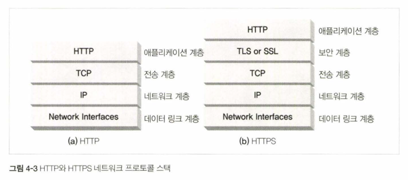
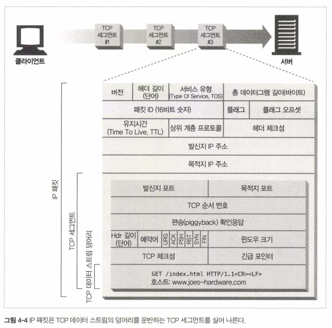
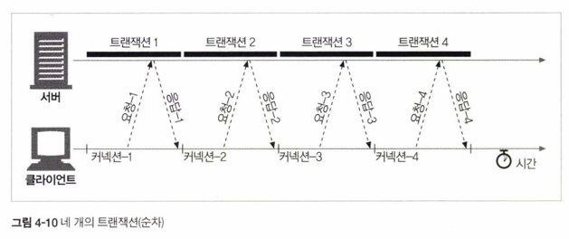

# 4장 커넥션 관리

- HTTP는 어떻게 TCP 커넥션을 사용하는가
- TCP 커넥션의 지연, 병목, 막힘
- 병렬 커넥션, keep-alive 커넥션, 커넥션 파이프라인을 활용한 HTTP의 최적화
- 커넥션 관리를 위해 따라야 할 규칙들

## 4.1 TCP 커넥션
- TCP/IP는 컴퓨터와 네트워크 장비에서 널리 쓰이는 패킷 교환 네트워크 프로토콜들의 계층화된 집합
- 모든 HTTP 통신은 TCP/IP를 통해 이루어짐
- 클라이언트 어플리케이션은 서버 어플리케이션으로 TCP/IP 커넥션을 맺을 수 있고, 일단 커넥션이 맺어지면 메시지는 손상 없이 전달됨


### 4.1.1. 신뢰할 수 있는 데이터 전송 통로인 TCP
- TCP는 HTTP에게 신뢰할 만한 통신 방식을 제공 (순서에 맞게 전달되는 바이트)
- HTTP 커넥션은 몇몇 규칙을 제외하고는 TCP 커넥션에 불과


### 4.1.2 TCP 스트림은 세그먼트로 나뉘어 IP 패킷을 통해 전송된다



- HTTP가 메시지를 전송하고자 하면, TCP/IP 소프트웨어에서 일어나는 일
    1. 연결되어 있는 TCP 커넥션을 통해서 메시지 데이터의 내용을 순서대로 보냄
    2. TCP는 세그먼트라는 단위로 데이터 스트림을 잘게 나눔
    3. 세그먼트를 IP 패킷(데이터그램)이라는 봉투에 담아서 인터넷을 통해 하나의 IP 주소에서 다른 IP 주소로 전달함

- TCP 세그먼트가 담긴 IP 패킷 하나에 포함되는 정보
  - IP 패킷 헤더: 발신지/목적지 IP 주소, 크기, 기타 플래그
  - TCP 세그먼트 헤더: TCP 포트 번호, TCP 제어 플래그, 데이터 순서/무결성 검증을 위한 숫자값(체크섬)
  - TCP 데이터 조각



### 4.1.3 TCP 커넥션 유지하기
- TCP는 포트 번호를 통해서 컴퓨터가 가진 여러 개의 커넥션을 유지함
- TCP 커넥션은 4가지 식별 가능한 값으로 유일한 커넥션을 생성
  - 발신지(클라이언트) IP 주소
  - 발신지(클라이언트) 포트 번호
  - 수신지(서버) IP 주소
  - 수신지(서버) 포트 번호


### 4.1.4 TCP 소켓 프로그래밍
- 운영체제는 TCP 커넥션의 생성과 관련된 기능을 제공함
- 예를 들어 소켓 API를 통해, TCP 종단(endpoint) 데이터 구조를 생성하고, 원격 서버의 TCP 종단에 연결하여 데이터 스트림을 읽고 쓸 수 있음
- TCP API는 세부사항을 숨기고, 개발자에게는 TCP 커넥션을 통해 데이터를 전송할 수 있는 인터페이스를 제공함 (네트워크 프로토콜의 핸드셰이킹, 데이터스트림의 세그먼트화, IP 패킷화 등의 복잡한 작업을 대신함)


- S4. 서버가 커넥션을 기다림
- C3. IP 주소와 포트 번호 알아낸 클라이언트가 서버에 TCP 커넥션 생성 시작
- C5. 클라이언트가 HTTP 요청을 서버로 보냄
- S6. 서버가 요청을 읽기 시작
- S7. 서버가 요청 메시지를 다 받고 클라이언트가 요청한 동작을 수행
- C6. 클라이언트가 서버로부터 응답을 받음
- C7. 클라이언트가 응답 데이터를 처리함

## 4.2 TCP의 성능에 대한 고려

- TCP 커넥션의 성능은 HTTP 트랜잭션의 성능에 영향을 미침
- HTTP 트랜잭션의 성능을 높이기 위해서는 TCP 커넥션의 성능을 최적화해야 함

### 4.2.1 HTTP 트랜잭션 지연


- 트랜잭션 처리 시간 < TCP 커넥션 설정, 요청 전송, 응답 메시지 전송 시간
- 대부분의 HTTP 지연은 TCP 네트워크 지연 때문에 발생

- HTTP 트랜잭션의 지연 원인
  1. URI의 호스트 이름을 IP 주소로 변환하는 DNS 조회 (방문한 적 없는 호스트라면 지연)
  2. 서버의 커넥션 허가를 기다려 커넥션 설정 (수백 개의 HTTP 트랜잭션이라면 지연)
  3. 커넥션 설정 후 전송한 요청 메시지가 인터넷을 통해 전달되고 서버가 처리하는 시간
  4. 웹 서버가 HTTP 응답을 보내는 시간

### 4.2.2 성능 관련 중요 요소

- HTTP 프로그래머에게 영향을 주는 가장 일반적인 TCP 관련 지연
  1. TCP 커넥션 핸드셰이크 설정
  2. 인터넷의 혼잡을 제어하기 위한 TCP의 느린 시작(slow start)
  3. 데이터를 한데 모아 한번에 전송하기 위한 네이글(nagle) 알고리즘
  4. TCP의 편승 확인응답(piggyback acknowledgement)을 위한 확인응답 지연 알고리즘
  5. TIME_WAIT 상태의 누적과 포트 고갈

### 4.2.3 TCP 커넥션 핸드셰이크 지연

- 새로운 TCP 커넥션이 생성될 때 발생하는 지연
- 이때 TCP 소프트웨어는 커넥션을 맺기 위한 조건을 맞추기 위해 연속으로 IP 패킷을 교환
- 크기가 작은 HTTP 트랜잭션은 50% 이상의 지연을 TCP 커넥션 설정에 소비 --> HTTP의 커넥션 재사용이 중요


### 4.2.4 확인응답 지연

- 인터넷 라우터는 과부하가 걸리면 패킷을 파기할 수 있음 
- TCP는 성공적인 데이터 전송을 보장하기 위한 자체 확인 체계를 가짐
  - 각 TCP 세그먼트는 순번, 데이터 무결성 체크섬을 가짐
  - 수신자는 세그먼트를 받으면 확인응답을 보내고, 송신자는 확인응답을 받지 못하면 데이터를 다시 전송 
  - 이 확인응답을 다른 데이터 패킷에 편승시켜 효율적으로 전송하기 위해서, TCP 스택에 '확인응답 지연' 알고리즘이 있음
- HTTP 동작 방식엔 요청/응답 두 형식만 있어 확인응답을 편승시킬 패킷이 많지 않아 이 알고리즘으로 인한 지연이 다발
- 확인응답 지연 관련 기능은 수정하거나 비활성화할 수 있음

### 4.2.5 TCP 느린 시작(slow start)

- TCP 커넥션은 인터넷 혼잡을 제어하기 위해 느린 시작 알고리즘을 사용
- 처음에는 커넥션의 최대 속도(1회 전송 패킷 수)를 제한하고, 데이터가 성공적으로 전송되면 속도 제한을 높여나감(opening the congestion window)
- HTTP는 빠른 속도를 위해 존재하는 커넥션을 재사용함(지속 커넥션)

### 4.2.6 네이글(Nagle) 알고리즘과 TCP_NODELAY

- 각 TCP 세그먼트는 40바이트 상당의 플래그와 헤더를 포함해 전송되기 때문에, 작은 크기의 패킷을 많이 전송하면 네트워크 성능은 떨어짐
- 네이글 알고리즘
  - 네트워크 효율을 위해 패킷을 전송하기 전 TCP 데이터를 한 개의 덩어리로 합침
  - 다른 패킷들이 전송 중이면 데이터는 버퍼에 저장됨, 세그먼트가 최대 크기가 되지 않으면 전송하지 않고 충분히 쌓였을 때나 기다리던 확인응답을 받았을 때 한 번에 전송
  - 다른 모든 패킷이 확인응답을 받았을 때는 예외 (작은 패킷을 전송)
- 네이글 알고리즘의 HTTP 성능 문제
  - 크기가 작은 HTTP 메시지는 생길지 모르는 추가 데이터를 기다리며 전송 지연됨
  - 확인응답 지연 알고리즘이 네이글 알고리즘이 기다리는 확인응답을 지연시킴
  - HTTP 스택에 TCP_NODELAY 파라미터 값을 설정하여 네이글 알고리즘을 비활성화할 수 있음 (큰 크기로 데이터 만들도록 주의)

### 4.2.7 TIME_WAIT의 누적과 포트 고갈

- TCP endpoint에서 커넥션이 끝나면 TIME_WAIT 상태로 전환 
- 같은 주소와 포트 번호를 기록해 사용하는 TCP 커넥션이 일정시간(2MSL, 2분) 동안 새로 생성되지 않도록 함
- 이전 커넥션 관련 패킷이 새로운 커넥션에 삽입되는 것 방지

- 성능 시험을 할 때, 가능한 연결 조합이 제한적이나 포트 재활용 불가
- <클라이언트 IP, 발신지 포트, 서버 IP, 80>에서 발신지 포트만 변경 가능
- 서버의 처리 속도를 늦추거나 가상 IP 주소를 사용해 추가로 커넥션을 맺으면 포트가 고갈되지 않지만, 커넥션이나 제어 블록이 너무 많은 것도 운영체제에 따라 성능 문제 있음

## 4.3 HTTP 커넥션 관리

커넥션을 생성하고 최적화하는 HTTP 기술

### 4.3.1 흔히 잘못 이해하는 Connection 헤더


- HTTP 메시지는 클라이언트에서 서버까지 중개 서버(프락시 서버, 캐시 서버)를 하나하나 거쳐 전달됨 
- Connection 헤더는 이처럼 인접한 두 HTTP 애플리케이션이 맺고 있는 특정 커넥션에만 적용된 옵션을 지정하게 해 줌
- HTTP Connection 헤더 필드는 세 가지 커넥션 토큰을 쉼표로 구분하여 나열하고, 이 값은 다른 커넥션에 전달되지 않음
  - 헤더 필드 명: 현재 커넥션만을 위한 정보, 다른 곳으로 전달하는 시점에 삭제
  - 임시 토큰 값: 커넥션에 대한 비표준 옵션
  - close 값: 커넥션 작업이 완료되면 커넥션이 종료되어야 함
- 헤더 보호하기: 커넥션 헤더에 hop-by-hop 토큰을 추가하면, 이 헤더는 다음 서버로 전달되지 않음 
- 홉별(hop-by-hop): 특정 두 서버 간에만 영향을 미치고 다른 서버에는 영향을 미치지 않음 (hop: 각 서버)
- 커넥션 헤더는 HTTP/1.1에서만 사용 가능하며, HTTP/1.0에서는 무시됨

### 4.3.2 순차적인 트랜잭션 처리에 의한 지연



- 순차적인 처리는 심지어 동시 처리가 더 느리더라도 비선호됨
- 어떤 브라우저는 화면에 배치할 모든 객체의 크기를 알아야 하기 때문에 모두 내려받기 전까지 텅 빈 화면을 보여줌

- HTTP 커넥션의 성능을 향상시킬 수 있는 최신 기술
  1. 병렬(parallel) 커넥션: 여러 개의 TCP 커넥션을 통한 동시 HTTP 요청
  2. 지속(persistent) 커넥션: 커넥션을 맺고 끊는 데서 발생하는 지연을 제거하기 위한 TCP 커넥션의 재활용
  3. 파이프라인(pipelined) 커넥션: 공유 TCP 커넥션을 통한 병렬 HTTP 요청
  4. 다중(multiplexed) 커넥션: 요청과 응답들에 대한 중재(실험적)

## 4.4 병렬 커넥션


HTTP는 클라이언트가 여러 개의 커넥션을 맺어 여러 개의 HTTP 트랜잭션을 병렬로 처리할 수 있게 함

### 4.4.1 병렬 커넥션은 페이지를 더 빠르게 내려받는다

- 각 커넥션의 지연 시간을 겹치게 하면 총 지연 시간이 줄어듦
- 클라이언트의 인터넷 대역폭을 한 개의 커넥션이 다 쓰지 않는다면 남은 대역폭을 사용해 나머지 객체를 내려받을 수 있음

### 4.4.2 병렬 커넥션이 항상 더 빠르지는 않다

- 클라이언트의 대역폭이 좁을 때는 성능 상의 장점이 없음
- 다수의 커넥션은 메모리를 많이 소모하고 자체 성능 문제를 발생시킴
- 서버는 여러 클라이언트의 요청을 처리해야 하기 때문에 특정 클라이언트로부터 과도한 수의 커넥션이 맺어지면 이것을 끊어 서버 성능을 보호할 수 있음
- 실제로 브라우저는 6~8개의 병렬 커넥션을 지원 (HTTP/1.1은 2개의 병렬 커넥션을 권장)

### 4.4.3 병렬 커넥션은 더 빠르게 ‘느껴질 수’ 있다

- 페이지의 총 다운로드 시간과 별개로, 다운로드 작업이 일어나는 것을 화면에서 눈으로 확인할 수 있으면 더 빠르다고 여겨짐

## 4.5 지속커넥션

- 사이트 지역성(site locality): 웹 페이지의 객체들은 같은 서버에서 제공되는 경우가 많음
- 지속 커넥션: 처리 완료된 후에도 연결된 상태로 있는 TCP 커넥션. HTTP/1.1 지원 기기는 지속 커넥션을 앞으로 있을 요청에 재사용함. 트랜잭션의 각 처리가 끝날 때가 아니라, 클라이언트나 서버가 커넥션을 끊기 전까지 커넥션을 유지함
- 커넥션을 맺는 지연 시간과 slow start로 인한 지연 시간을 절약해 빠르게 데이터를 전송함

### 4.5.1 지속 커넥션 vs 병렬 커넥션

- 병렬 커넥션
  - (단점) 각 트랜잭션마다 새로운 TCP 커넥션을 맺어야 해 시간과 대역폭 소요
  - (단점) 각각의 새로운 커넥션은 TCP slow start 때문에 성능이 떨어짐
  - (단점) 실제로 연결할 수 있는 병렬 커넥션의 수는 제한적: 서버는 다수의 커넥션을 처리해야 하기 때문에 과도한 커넥션을 끊어야 할 수 있음

- 지속 커넥션의 장점
  - (장점) 커넥션을 맺기 위한 사전 작업, 지연 시간, slow start로 인한 지연 시간을 절약
  - (장점) 커넥션의 수 자체가 줄어듦
  - (단점) 잘못 관리하면 계속 연결된 상태로 있는 커넥션이 쌓여 로컬, 클라이언트, 서버 리소스를 불필요하게 소모함

- 병렬 커넥션과 지속 커넥션을 혼합해서 사용하면 최적의 성능을 얻을 수 있음
  - 적은 수의 병렬 커넥션을 맺고 유지함
  - keep-alive 커넥션과 지속 커넥션

### 4.5.2 HTTP/1.0+의 Keep-Alive 커넥션


- 연속적으로 커넥션을 생성하여 처리하는 것보다 커넥션을 재사용하는 것이 더 효율적 (커넥션 생성 작업, slow start)

### 4.5.3 Keep-Alive 동작

- HTTP/1.1에서 keep-alive 핸드셰이크가 빠졌지만, 아직 널리 사용되고 있기 때문에 처리할 수 있게 개발해야 함
- 커넥션을 유지하기 위해 요청에 Connection: Keep-Alive 헤더를 포함함, 서버가 다음 요청을 이 커넥션을 통해 받고자 하면 응답 메시지에 같은 헤더를 포함해야 함


### 4.5.4 Keep-Alive 옵션

```http request
- Connection: Keep-Alive
- Keep-Alive: max=5, timeout=120 (커넥션을 유지할 수 있는 최대 요청 수, 커넥션을 유지한 상태로 두는 시간)
```
- Keep-Alive 헤더는 커넥션을 유지하기를 바라는 요청
- 클라이언트나 서버는 이 헤더를 무시하고 keep-alive 커넥션을 끊을 수 있음, 처리되는 트랜잭션의 수도 제한할 수 있음

### 4.5.5 Keep-Alive 커넥션 제한과 규칙

- HTTP/1.0을 따르는 기기에서 온 Connection 헤더 필드는 무시해야 함
- HTTP/1.0에서 keep-alive는 기본이 아닌 옵션
  - keep-alive 커넥션을 사용, 유지하려면 클라이언트는 Connection: Keep-Alive 요청 헤더를 모든 메시지에 포함해야 함
  - Connection: Keep-Alive 응답 헤더가 없으면 서버가 응답 후 커넥션을 끊을 것을 알 수 있음
  - 엔터티 본문의 길이(Content-Length)를 알 수 있어야 커넥션을 유지할 수 있음
- 응답 전체를 받기 전에 keep-alive 커넥션이 끊어지면, 요청을 다시 보낼 수 있게 준비되어 있어야 함
- 프락시와 게이트웨이는 Connection 헤더의 규칙을 따라야 함: 메시지를 전달하거나 캐시에 넣기 전에 Connection 헤더 필드와 헤더를 제거해야 함
- keep-alive 커넥션은 Connection 헤더를 인식하지 못하는(dumb) 프락시 서버와 맺어지면 안 됨

### 4.5.6 Keep-Alive와 멍청한(dumb) 프락시

- 멍청한 프락시는 Connection 헤더를 이해하지 못함: Connection 헤더를 삭제하지 않고 그대로 다음 프락시에 전달함
- 그 결과 클라이언트와 서버는 사이에 둔 프락시와 keep-alive 커넥션을 유지하지만, 프락시는 이것을 모르기 때문에 유지된 커넥션에서 온 다른 요청을 무시하며 커넥션이 끊어지길 기다림
- 브라우저는 자신이나 서버가 타임아웃 되어 커넥션이 끊길 때까지 아무 응답을 받지 못하고 무한 로딩에 빠짐

### 4.5.7 Proxy-Connection 살펴보기

- 중개 서버가 요청의 모든 헤더를 무조건 전달하는 문제의 해결법: 비표준 Proxy-Connection 헤더


- 하지만 클라이언트와 서버 사이에 여러 멍청한 프락시와 영리한 프락시가 함께 있다면 Connection: keep-alive가 잘못 전해지는 문제는 여전히 발생
- 이런 프락시들은 네트워크 상에서 보이지 않는 경우가 많음: 방화벽, 캐시 서버, 리버스 프락시 서버 가속기
  - 보이지 않는 웹 애플리케이션은 지속 커넥션을 명확히 구현해야 함
  - 브라우저가 볼 수 없으므로 Proxy-Connection 헤더를 보낼 수도 없음


### 4.5.8 HTTP/1.1의 지속 커넥션

- keep-alive 커넥션 대신 기본으로 지속 커넥션 지원
- 트랜잭션이 끝난 다음 커넥션을 끊다는 의미로 Connection: close 헤더를 사용하지만, 그렇지 않아도 언제든 커넥션을 끊을 수 있음

### 4.5.9 지속 커넥션의 제한과 규칙

- 클라이언트는 요청에 Connection: close 헤더를 포함했다면 그 커넥션으로 추가 요청을 보낼 수 없음
- 클라이언트는 추가 요청을 보내지 않을 것이라면 마지막 요청에 Connection: close 헤더를 포함해야 함
- 서버는 메시지를 전송하는 중간에 커넥션을 끊지 않음, 커넥션을 끊기 전 최소 1개 요청에 응답함
- 커넥션 상의 모든 메시지가 정확한 길이 정보를 가지고 있어야 커넥션을 지속시킬 수 있음
  - 정확한 Content-Length 값, 청크 전송 인코딩으로 된 엔터티 본문
- HTTP/1.1 프락시는 클라이언트와 서버에 각각 지속 커넥션을 맺고 관리함
- HTTP/1.1 프락시는 클라이언트가 커넥션 관련 기능에 대한 지원 범위를 알고 있지 않으면(오래된 프락시가 Connection 헤더를 전달할 수 있어) 지속 커넥션을 맺으면 안 됨
- HTTP/1.1 기기는 Connection 헤더의 값과 무관하게 언제든 커넥션을 끊을 수 있음
- HTTP/1.1 애플리케이션은 중간에 끊어지는 커넥션을 복구할 수 있어야 함. 클라이언트는 요청을 다시 보내도 문제 없는 경우 다시 보낼 준비가 되어 있어야 함.
- 서버 과부하를 방지하기 위해 하나의 사용자 클라이언트당 2개의 지속 커넥션만을 유지해야 함

## 4.6 파이프라인 커넥션

HTTP/1.1은 지속 커넥션으로 요청을 파이프라이닝할 수 있음

- 여러 개의 요청은 응답 도착 전까지 큐에 쌓임 (각각 응답을 기다리지 않고 다음 요청을 보냄)
- 네트워크상의 왕복 시간을 줄여 성능 높임

- 파이프라인의 제약사항
  - 클라이언트는 지속 커넥션인지 확인하기 전에는 파이프라인을 이어선 안 됨
  - 응답은 요청 순서와 같게 와야 함 (메시지에는 순번이 없어서 정렬할 수 없음)
  - 클라이언트는 커넥션이 끊어졌을 때 완료되지 않은 요청이 파이프라인에 있으면 다시 요청을 보낼 준비가 되어 있어야 함
  - 클라이언트는 반복해 보내면 문제가 생기는 요청은 파이프라인을 통해 보내면 안 됨 (에러 발생 시 파이프라인의 요청 중 어떤 것이 처리되었는지 알 수 없게 되기 때문에)
    - 멱등 idempotent: 연산을 여러 번 수행해도 결과가 변하지 않음 (GET)
    - 비멱등 non-idempotent: 연산을 여러 번 수행하면 결과가 달라짐 (POST)


## 4.7 커넥션 끊기에 대한 미스터리

커넥션을 언제 어떻게 끊을지에 대해서는 명확한 기준이 없음

### 4.7.1 ‘마음대로' 커넥션 끊기

- 어떤 HTTP 클라이언트, 서버, 프락시도 언제든 TCP 전송 커넥션을 끊을 수 있음 (에러가 있을 땐 헤더 중간에도 끊길 수 있다)
- 파이프라인 지속 커넥션도 끊을 수 있음 -> 요청 메시지를 보내는 도중에 문제가 생길 수도

### 4.7.2 Content-Length와 Truncation

- 각 HTTP 응답은 본문의 정확한 크기 값을 가지는 Content-Length 헤더를 가지고 있어야 함 (오래된 서버는 생략하거나 잘못된 정보로 응답)
- 클라이언트나 프락시가 커넥션이 끊어졌다는 응답을 받은 후 Content-Length의 값이 실제 전달된 엔터티 길이와 다르거나 존재하지 않으면 데이터의 정확한 길이를 서버에 물어야 함
- 수신자가 캐시 프락시인 경우 응답 메시지를 받은 그대로 전달하고, 캐시하지 않음

### 4.7.3 커넥션 끊기의 허용, 재시도, 멱등성

- 커넥션은 에러가 없어도 끊을 수 있음
- HTTP 애플리케이션은 커넥션이 예상치 못하게 끊어졌을 때 적절히 대응할 수 있어야 함
- 파이프라인 커넥션에서의 어려움: 클라이언트가 큐에 쌓은 여러 요청을 모두 처리하지 않고 서버가 커넥션을 끊을 수 있음, 응답 받기 전이면 클라이언트는 얼만큼 처리되었는지 알 수 없음
- 멱등성: 클라이언트가 요청을 다시 보내도 결과가 변하지 않는 연산 (GET)
- POST와 같이 멱등이 아닌 요청은 파이프라인을 통해 요청하면 안 됨, 커넥션이 끊어졌을 때 알 수 없는 결과를 초래할 수 있음
- 브라우저가 캐시된 POST 요청 페이지를 다시 로드할 때 요청을 다시 보낼지 물어보는 이유

### 4.7.4 우아한커넥션 끊기

- TCP 커넥션은 양방향, 양쪽에 서로의 입력 큐와 출력 큐가 있음


1. 전체 끊기와 절반 끊기

- 애플리케이션은 TCP 입력 채널, 출력 채널 중 하나만 끊을 수 있음
- 전체 끊기: close() 호출
- 절반 끊기: shutdown() 호출


2. TCP 끊기와 리셋 에러

- 절반 끊기를 사용하는 이유: 예상치 못한 쓰기 에러를 예방하기 위해 출력 채널을 끊음
- 입력 채널 끊기는 위험: 클라이언트가 이미 끊긴 입력 채널에 데이터를 전송하면 서버의 운영체제는 TCP 'connection reset by peer' 에러를 발생시킴, 이 에러가 발생하면 운영체제 버퍼의 데이터가 삭제됨 (이미 받은 응답 데이터도 읽기 전에 삭제됨)

3. 우아하게 커넥션 끊기

- 클라이언트나 서버가 예기치 않게 커넥션을 끊어야 한다면 우아하게: 애플리케이션 자신의 출력 채널을 끊고 다른 쪽 기기의 출력 채널이 끊기기를 기다리는 것
- 상대 애플리케이션이 우아하게 끊었는지는 알 수 없음: 입력 채널 상태 검사를 주기적으로 해서 데이터나 스트림의 끝을 식별해야 함
- 입력 채널이 타임아웃 시간 내에 끊어지지 않으면 커넥션을 강제로 끊어 리소스를 보호할 수 있음