# 5장 웹 서버

- 여러 종류의 소프트웨어, 하드웨어 웹 서버 조사
- HTTP 통신을 진단해주는 간단한 웹 서버를 Perl로 작성
- 웹 서버가 HTTP 트랜잭션을 처리하는 방법을 설명

## 5.1 다채로운 웹 서버

- 웹 서버 소프트웨어 & 웹페이지 제공에 특화된 컴퓨터 등의 장비
- 리소스에 대한 HTTP 요청을 받아서 처리하고 응답하는 콘텐츠를 클라이언트에게 제공

### 5.1.1 웹 서버 구현

웹 서버
- HTTP 프로토콜, 관련된 TCP 처리 구현, 웹 리소스 관리, 웹 서버 관리 기능 제공
- TCP 커넥션 관리 책임을 운영체제와 분담 (운영체제: 컴퓨터 하드웨어 관리, TCP/IP 네트워크 지원, 웹 리소스 유지하기 위한 파일 시스템, 연산활동 제어하기 위한 프로세스 관리)

### 5.1.2 다목적 소프트웨어 웹 서버

- 네트워크에 연결된 표준 컴퓨터 시스템에서 동작함
- (상용 소프트웨어) 2014년 4월 기준, 모든 인터넷 웹사이트의 37%가 마이크로소프트 웹 서버로 서비스됨
- (오픈소스 소프트웨어) 아파치 웹 서버는 35%로 두 번째로 많이 사용됨

### 5.1.3 임베디드 웹 서버

- 가전제품 등에 내장될 목적으로 만들어진 작은 웹 서버
- 기기를 웹 브라우저 인터페이스로 관리할 수 있게 함

## 5.2 간단한 펄 웹 서버

- HTTP/1.1 기능을 지원하는 웹 서버는 큼(아파치 웹 서버 코어 코드 50,000줄 + 처리 모듈)
- Perl(펄) 코드로 작성한 최소 기능의 웹 서버 type-o-serve

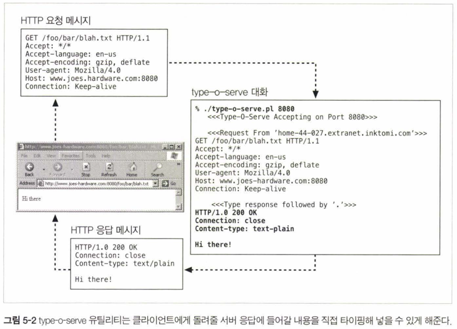

1. 특정 포트로 수신하는 type-o-serve 진단 서버 시작
   1. 이미 80번 포트로 수신하는 웹 서버가 있음
   2. `% type-o-serve.pl 8080` 사용하지 않는 포트로 서버 시작
2. 서버가 동작하면 브라우저로 서버에 접근 (http://www.joes-hardware.com:8080/foo/bar/blah.txt)
3. 서버는 브라우저로부터 HTTP 요청 메시지를 받아(GET) 화면에 출력
4. 서버는 "." 줄로 끝나는 응답 메시지 입력을 기다림
5. 서버는 응답 메시지를 브라우저로 전송
6. 브라우저는 응답 메시지 본문을 출력

```
#!/usr/bin/perl

use Socket;
use Carp;
use FileHandle;

# (1) 명령줄에서 덮어쓰지 않는 이상 8080 포트롤 기본으로 사용한다.
$port = (@ARGV ? $ARGV[0] : 8080);

# (2) 로컬 TCP 소켓을 생성하고 커넥션을 기다리도록(listen) 설정한다.
$proto = getprotobyname('tcp');
socket(S, PF_INET, SOCK_STREAM, $proto) || die;
setsockopt(S, SOL_SOCKET, SO_REUSEADDR, pack("l", 1)) || die;
bind(S, sockaddr_in($port, INADDR_ANY)) || die;
listen(S, SOMAXCONN) || die;

# (3) 시작에시지를 출력한다.
printf("    <<<Type-O-Serve Accepting on Port %d>>>\n\n",$port);

while (1)
{
    # (4) 커넥션 C를 기다린다.
    $cport_caddr = accept(C, S);
    ($cport, $caddr) = sockaddr_in($cport_caddr);
    C->autoflush(1);
    
    # (5) 누구로부터의 커넥션인지 출력한다.
    $cname = gethostbyaddr( $caddr,AF_INET);
    printf("    <<<Request From '%s'>>>\n",$cname);

    # (6) 빈줄이 나올 때까지 요청 메시지를 읽어서 화면에 출력한다.
    while ($line = <C>)
    {
        print $line;
        if ($line =~ /^\r/) { last; }
    }
    
    # (7) 응답 메시지를 위한 프롬프트를 만들고, 응답줄을 입력 받는다.
    # "." 하나만으로 되어 있는 줄이 입력되기 전까지, 입력된 줄을 클라이언트에게 보낸다.

    pnntf("    <<<Type Response Followed by '.'>>>\n");

    while ($line = <STDIN>)
    {
        $line =~ s/\r//;
        $line =~ s/\n//;
        if ($line =~ /^\./) { last; }
        print C $line . "\r\n";
    }
    close(C);
}
```

## 5.3 진짜 웹 서버가하는 일

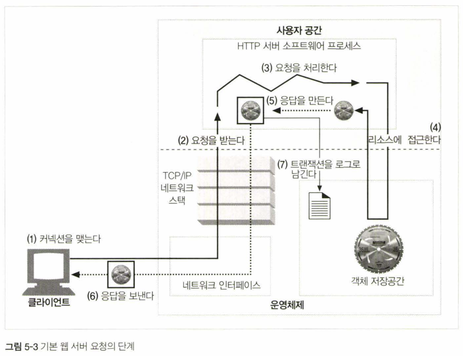

상용 웹 서버의 공통적인 기능
1. 클라이언트 커넥션 수락
2. 요청 메시지 수신
3. 요청 처리
4. 리소스의 매핑과 접근
5. 응답 만들기
6. 응답 보내기
7. 로깅

## 5.4 단계 1: 클라이언트 커넥션 수락

- 클라이언트는 이미 서버에 대해 열려 있는 지속적 커넥션을 사용할 수 없다면, 새 커넥션을 열어야 함

### 5.4.1 새 커넥션 다루기

- 웹 서버는 모든 커넥션을 거절하거나 즉시 닫을 수 있음 (클라이언트의 IP 주소, 호스트명이 비인가, 악성일 때)
1. 클라이언트가 웹 서버에 TCP 커넥션 요청
2. 웹 서버는 커넥션 수락, TCP 커넥션에서 IP 주소 추출해서 클라이언트 확인
3. 웹 서버는 새 커넥션을 커넥션 목록에 추가하고 커넥션 상의 데이터를 지켜봄

### 5.4.2 클라이언트 호스트 명 식별

- 대부분 역방향(reverse) DNS로 IP 주소를 호스트명으로 변환
- 클라이언트 호스트명은 구체적인 접근 제어와 로깅에 사용 
- hostname resolution(분석)은 꺼두고, 특정 콘텐츠에만 사용, 시간이 걸려 웹 트랜잭션 느려짐

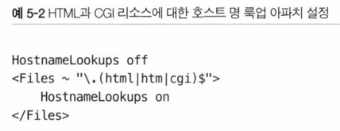

### 5.4.3 ident를 통해 클라이언트 사용자 알아내기

- IETF ident 프로토콜: 서버가 HTTP 커넥션을 초기화한 클라이언트 사용자를 알아낼 수 있음, 로그 포맷에 ident 필드가 있음
- 서버와 커넥션이 맺어졌을 때, 클라이언트가 ident 프로토콜을 지원하면, 클라이언트는 identd 서버 포트(113)를 listen 하고, 서버는 여기에 요청을 보내 커넥션의 사용자 정보를 얻음

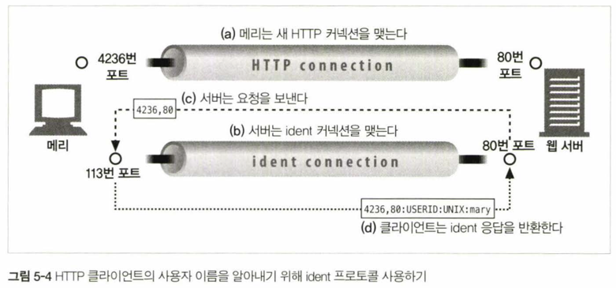

- 조직 외부 공공 인터넷에서는 잘 동작하지 않음
  - 클라이언트 PC가 identd 데몬 소프트웨어를 실행하지 않음
  - ident 프로토콜은 가상 IP 주소를 잘 지원하지 않음 
  - ident 프로토콜은 안전하지 않고 조작하기 쉬움 (보안 문제)
  - ident 프로토콜은 HTTP 트랜잭션을 지연시킴
  - 방화벽이 ident 트래픽을 차단
  - 클라이언트 사용자 이름 노출은 프라이버시 침해의 우려가 있음

## 5.5 단계 2: 요청 메시지 수신

- 네트워크 커넥션에 데이터가 도착하면, 웹 서버는 데이터를 읽고 파싱해서 요청을 이해함
- 커넥션 무효화를 대비해 메시지를 메모리에 임시 저장할 필요가 있음

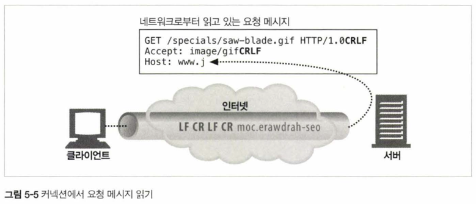

요청 메시지 파싱 과정
- 요청줄을 파싱하여 요청 메서드, 지정된 리소스의 식별자(URI), 버전 번호를 찾는다. 각 값은 스페이스 한 개로 분리되어 있으며, 요청줄은 캐리지 리턴줄바꿈(CRLF) 문자열로 끝난다. 
- 메시지 헤더들을 읽는다. 각 메시지 헤더는 CRLF로 끝난다. 
- 헤더의 끝을 의미하는 CRLF로 끝나는 빈 줄을 찾아낸다. (존재한다면)
- 요청 본문이 있다면, 읽어 들인다(길이는 Content-Length 헤더로 정의된다).

### 5.5.1 메시지의 내부 표현

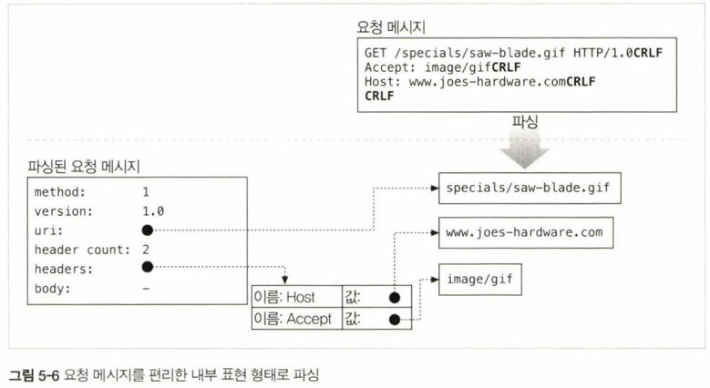

- 요청 메시지를 쉽게 다루기 위해 내부 자료 구조에 저장할 수 있음
- 헤더를 룩업 테이블에 저장해 신속하게 접근, 메시지의 각 조각에 대한 포인터와 길이를 저장

### 5.5.2 커넥션 입력/출력 처리 아키텍처

웹 서버의 아키텍처마다 요청을 처리하는 방식이 다름

1. 단일 스레드 웹 서버
   1. 한 번에 하나씩 요청을 처리
   2. 요청을 처리하는 동안 다른 요청을 받지 않음
   3. 구현 쉬움, 심각한 성능 문제 초래

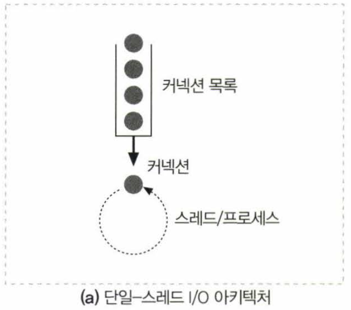

2. 멀티프로세스와 멀티스레드 웹 서버
   1. 여러 요청을 동시에 처리
   2. 여러 개의 프로세스/스레드를 (미리) 만들어 커넥션당 하나를 할당 (프로세스: 메모리 공유 X, 스레드: 메모리 공유 O)
   3. 스레드/프로세스의 최대 개수를 제한해 메모리, 시스템 리소스 소비를 제한

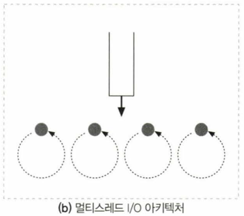

3. 다중 I/O 서버
   1. 모든 커넥션을 동시에 모니터링
   2. 상태가 바뀐 커넥션을 처리하고, 커넥션 목록으로 돌려보냄
   3. 스레드/프로세스는 유휴 상태의 커넥션에 리소스를 낭비하지 않음, 실제로 해야 할 일이 있을 때만 그 커넥션에 대한 작업 수행

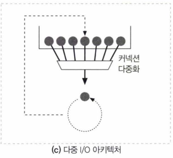

4. 다중 멀티스레드 웹 서버
   1. 멀티스레딩(CPU 여러 개) + 다중화 결합
   2. 여러 개의 스레드가 각각 열려 있는 커넥션 또는 커넥션 그룹을 모니터링하고 필요한 작업을 처리

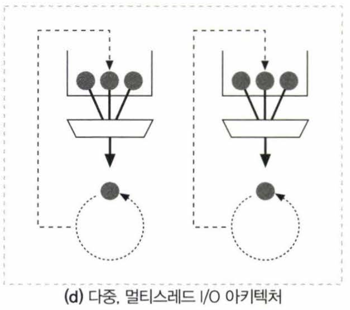

## 5.6 단계 3: 요청 처리

- 서버는 요청으로부터 메서드, 리소스, 헤더, 본문을 얻어 처리

## 5.7 단계 4: 리소스의 매핑과 접근

- 웹 서버는 리소스 서버: 미리 만들어진 정적 콘텐츠 제공, 서버 위에서 동작하는 리소스 생성 애플리케이션으로 만들어진 동적 콘텐츠 제공
- 콘텐츠를 전달하려면 요청 메시지의 URI에 대응하는 콘텐츠나 콘텐츠 생성기를 웹 서버에서 찾아서 원천을 식별해야 함

### 5.7. 1 Docroot

1. docroot

- 문서 루트(docroot): 웹 콘텐츠를 위해 예약된 웹 서버 파일 시스템의 폴더, 이외 부분이 노출되지 않도록 해야 함 (/../ 같은 경로 탐색 방지)
- 요청 메시지에서 URI를 추출해서 문서 루트 뒤에 붙임

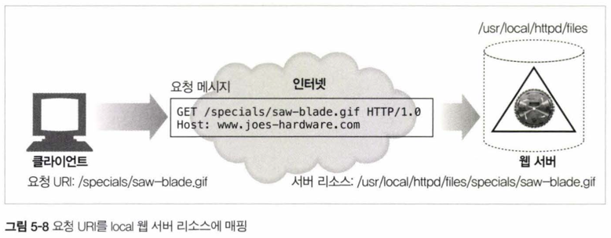

2. 가상 호스팅된 docroot

- 가상 호스팅: 하나의 웹 서버가 여러 도메인을 호스팅하는 것
- 각 사이트에 대해 별도의 docroot를 설정하고, IP 주소나 호스트명으로 적절한 docroot를 선택

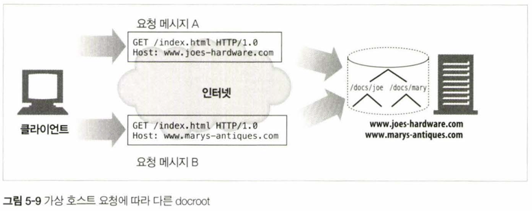

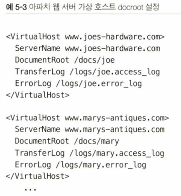

3. 사용자 홈 디렉토리 docroots

- 한 대의 웹 서버에 여러 사용자들이 각각 사이트를 만들 수 있게 함 (/~username/ URI는 사용자 개인 문서 루트)

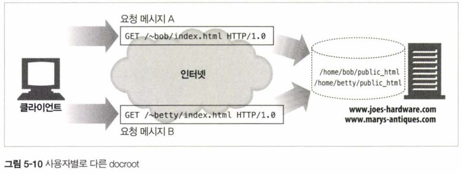

## 5.7.2 디렉터리 목록

- 파일이 아닌 디렉토리 URL을 요청했을 때 서버의 행동
  - 디렉토리에서 index.html 파일을 찾아서 반환
  - 에러 반환
  - 지정된 색인 파일 반환: DirectoryIndex로 나열된 파일 중 하나
  - 자동생성된 색인 파일 반환: 디렉토리의 파일을 크기, 변경일, 링크와 함께 나열한 HTML 페이지

## 5.7.3 동적 콘텐츠 리소스 매핑

- 웹 서버 중 애플리케이션 서버: 웹 서버를 백엔드 애플리케이션과 연결, 동적 콘텐츠 요청 시 생성 프로그램의 위치와 실행 방법을 알려줌
- URI를 동적 리소스에 매핑: 요청에 맞게 콘텐츠를 생성하는 프로그램에 URI 매핑, 요청의 실행 가능한 경로명에 대응하는 디렉토리에서 프로그램을 찾음

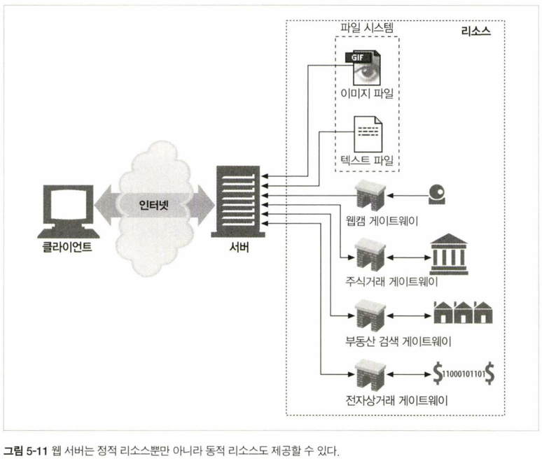

## 5.7.4 서버사이드 인클루드(Server-Side Includes, SSI)

- 동적 콘텐츠를 만드는 방법
- 서버사이드 인클루드가 있는 리소스라면, 웹 서버는 클라이언트에게 리소스를 반환하기 전에 SSI를 처리
- HTML 주석 안에 SSI 명령어가 있는지 검사하고 변수 값이나 실행 가능한 스크립트의 출력값으로 치환

## 5.7.5 접근 제어

- 접근이 제어된 리소스에 대한 요청이라면, 웹 서버는 클라이언트의 IP 주소나 호스트명을 확인해 접근을 제어하거나 접근 비밀번호를 물어볼 수 있음

## 5.8 단계 5:응답 만들기

- 서버가 리소스를 식별하면, 요청 메서드의 동작을 수행하고 응답 메시지(상태코드, 헤더, 본문)를 반환

### 5.8.1 응답 엔터티

- 트랜잭션이 응답 본문을 생성한다면 응답 메시지에 포함됨
  - Content-Type: 응답 본문의 MIME 타입
  - Content-Length: 응답 본문의 길이
  - 응답 본문의 내용

### 5.8.2 MIME 타입 결정하기

- 웹 서버는 응답 본문(리소스)의 MIME 타입을 결정해야 함

1. mime.types
   - 웹 서버는 파일 확장자를 MIME 타입으로 매핑하는 mime.types 파일을 사용

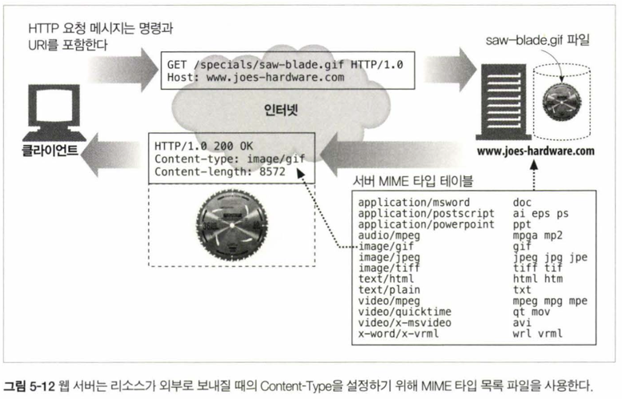

2. 매직 타이핑(Magic typing)
   - 파일의 내용을 보고 매직 파일(타입별 패턴 테이블)을 기준으로 MIME 타입을 결정
   - 표준 확장자 없이 이름 지어진 경우, 느려도 편리

3. 유형 명시(Explicit typing)
   - 특정 파일, 디렉토리에 대해 MIME 타입을 지정하도록 서버 설정

4. 유형 협상(Type negotiation)
   - 한 리소스가 여러 종류의 형식에 속하도록 설정
   - 사용자와의 협상을 통해 사용하기 가장 좋은 형식과 MIME 타입을 판별할지 여부도 설정

### 5.8.3 리다이렉션

- 3XX 상태코드
- 리소스가 다른 곳에 있을 때, 클라이언트에게 새로운 URI로 이동하라고 알려줌

1. 영구히 리소스가 옮겨진 경우 (또는 이름 변경)
   - 301 Moved Permanently: 리소스가 새로운 URI로 옮겨졌으며, 앞으로는 새 URI를 사용해야 함(북마크 갱신)
2. 임시로 리소스가 옮겨진 경우 (또는 이름 변경)
   - 303 See Other: 리소스가 다른 URI로 옮겨졌으며, 클라이언트는 이번에 GET 메서드를 사용해 새 URI로 이동해야 함(북마크 유지)
   - 307 Temporary Redirect: 303과 비슷하지만, 클라이언트는 요청 메서드를 그대로 사용해야 함
3. URL 증강
   - 상태정보가 추가된 URL을 생성하고 클라이언트를 리다이렉트, 클라이언트는 이 URL을 사용해 요청을 다시 보냄
   - 303, 307 상태코드 사용
4. 부하 균형
   - 부하 균형을 위해 클라이언트를 다른 서버로 리다이렉트
   - 303, 307 상태코드 사용
5. 친밀한 다른 서버가 있을 때
   - 이 클라이언트에 대한 정보를 가진 다른 서버로 리다이렉트
   - 303, 307 상태코드 사용
6. 디렉토리 이름 정규화
   - 디렉터리 URI를 요청할 때 슬래시(/)를 빼먹었을 때, 서버는 슬래시를 추가해 리다이렉트

## 5.9 단계 6: 응답 보내기

- 지속적인 커넥션에 주의하며 커넥션 상태를 추적
- 지속적 커넥션 열어둠: 서버가 Content-Length 헤더를 특히 바르게 계산해야 할 때, 클라이언트가 응답이 언제 끝날지 모를 때
- 비지속적 커넥션 닫음: 서버가 모든 메시지 전송했을 때 

## 5.10 단계 7: 로깅

- 트랜잭션이 완료되면 트랜잭션 수행 로그를 로그 파일에 기록