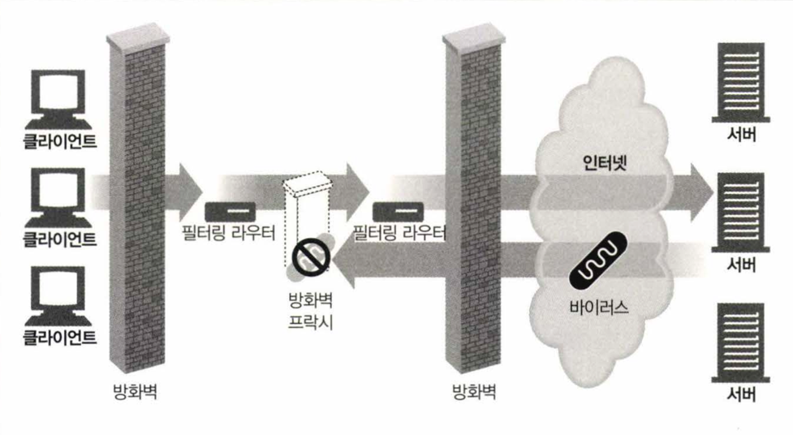
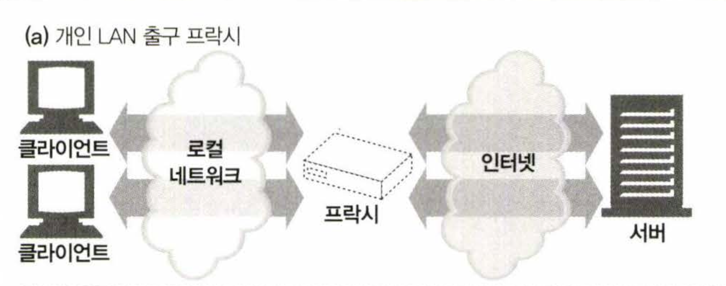
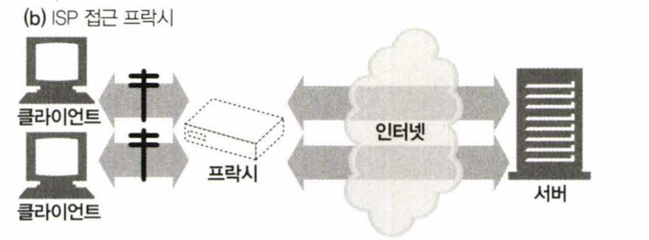
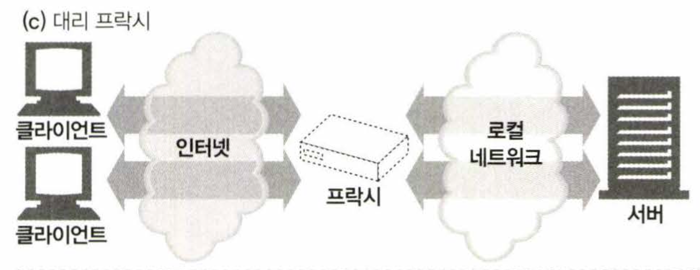
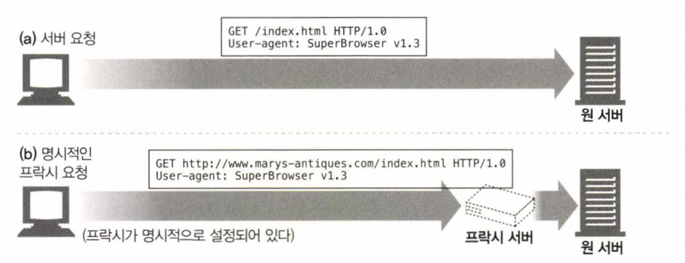

# 6.1 웹 중개자

웹 프락시 서버는 클라이언트 입장에서 트랜잭션을 수행하는 중개인임. 프락시가 없다면 클라이언트는 HTTP 서버와 직접 소통해야 함.

HTTP 프락시 서버는 웹 서버이기도 하며, 웹 클라이언트이기도 함.

- HTTP 클라이언트의 요청을 받고, HTTP 클라이언트에게 응답을 돌려주기 때문에 웹 서버
- HTTP 클라이언트 대신 웹 서버에 요청을 보내고, 웹 서버로부터 응답을 받아 클라이언트에게 전달하기 때문에 웹 클라이언트


## 6.1.1 개인 프락시와 공유 프락시

프락시 서버는 하나의 클라이언트가 독점적으로 사용할 수도 있고, 여러 클라이언트가 공유할 수도 있음.
하나의 클라이언트만을 위한 프락시를 개인프락시라 하며, 여러 클라이언트가 공유하는 프락시를 공용 프락시라 함.

### 공용 프락시

대부분의 프락시는 공용이며, 공유된 프락시임.

- 중앙 집중형 프락시를 관리하는게 비용효율이 높고 쉬움
- 캐시 프락시 같은 경우 이용자가 많을 수록 유리한데, 여러 사용자들의 공통된 요청에서 이득을 취할 수 있기 때문

### 개인 프락시

흔하지는 않지만, 꾸준히 사용되고 있음. (클라이언트의 컴퓨터에서 직접 실행되는 형태로)

- 브라우저의 보조 제품들은 브라우저의 기능을 확장하거나, 성능을 개선하거나, 무료 ISP 서비스를 위한 광고를 운영하기 위해 작은 프락시를 사용자의 컴퓨터에서 직접 실행하게 함

## 6.1.2 프락시 대 게이트웨이

프락시와 게이트웨이는 HTTP 트랜잭션을 중개하는 중개자임.

- 프락시의 경우 같은 프로토콜을 사용하는 둘 이상의 애플리케이션을 연결함
- 게이트웨이는 서로 다른 프로토콜을 사용하는 둘 이상을 연결함


# 6.2 왜 프락시를 사용하는가?

### 어린이 필터

어린이 필터는 부모가 자녀가 볼 수 있는 웹 페이지를 제어하기 위해 사용하는 프락시임.


### 문서 접근 제어자

프락시 서버는 많은 웹 서버들과 웹 리소스에 대한 단일 접근 제어 전략을 구현하고, 감사 추적(audit trail)을 하기 위해 사용될 수 있다.
> 감사 추적은 사용자가 어떤 웹 페이지를 요청했는지, 어떤 웹 페이지를 본 것인지, 어떤 웹 페이지에 접근을 시도했는지 등을 추적하는 것임.

- 대기업 환경이나 분산된 관료 조직에서 유용함
- 다양한 종류의 웹 서버들에 대한 접근 제어를 수시로 갱신할 필요 없이 중앙 프락시 서버에서 접근 제어를 설정할 수 있다.


### 보안 방화벽

보안 방화벽은 네트워크의 내부와 외부 사이에 위치하며, 내부 네트워크를 보호하기 위해 외부 네트워크로부터의 악의적인 접근을 제어함.

- 조직 안에 들어오거나 나가는 응용 레벨 프로토콜의 흐름을 네트워크의 한 지점에서 통제함
- 바이러스를 제거하는 웹이나, 이메일 프락시가 사용할 수 있는 트레픽을 세심히 살펴 볼 수 있는 Hook을 제공함



### 웹 캐시

프락시 캐시는 인기 있는 문서의 로컬 사본을 관리하고 해당 문서에 대한 요청이 오면 빠르게 제공하여, 느리고 비싼 인터넷 커뮤니케이션을 줄인다.


### 대리 프락시

리버스 프락시라고도 불리며, 대리 프락시는 클라이언트가 원격 서버에 직접 접근하는 대신, 대리 프락시가 클라이언트를 대신하여 원격 서버에 접근하고, 원격 서버로부터 응답을 받아
클라이언트에게 전달함.

- 진짜 웹 서버 요청을 받지만 웹 서버와는 달리 요청 받은 콘텐츠의 위치를 찾아내기 위해 다른 서버와 커뮤니케이션을 시작함.
- 콘텐츠 라우팅 기능과 결합되어 주문형 복제 콘텐츠의 분산 네트워크를 만들기 위해 사용될 수 있다.


### 콘텐츠 라우터

콘텐츠 라우터는 콘텐츠에 따라 다른 서버로 요청을 라우팅하는 프락시임.

- 사용자들에게 제공할 여러 서비스를 구현하는데 사용할 수 있음.
- 예를 들어 사용자나 콘텐츠 제공자가 더 높은 성능을 위해 돈을 지불했다면, 콘텐츠 라우터는 요청을 가까운 복제 캐시로 전달할 수 있음.


### 트렌스 코더

트렌스 코더는 클라이언트와 서버 간에 전송되는 콘텐츠를 변환하는 프락시임.
> 트렌스 코딩은 이와 같이 데이터의 표현 방식을 자연스럽게 변환하는 것을 의미함

- 트랜스코딩 프락시는 크기를 줄이기 위해 자신을 거쳐 가는 GIF 이미지를 JPG 이미지로 변환할 수 있음.
- 텍스트파일은 압축하고, 스마트폰을 위한 작은 텍스트로 줄인 웹 페이지를 생성할 수 있음.
- 외국어 문서로 변환하는 것 역시 가능함


### 익명화 프락시

익명화 프락시는 HTTP 메시지에서 신원을 식별할 수 있는 특성들을(예: 클라이언트 IP, From 헤더, Referer 헤더, 쿠키, URI 세션 아이디) 적극적으로 제거함으로써
개인 정보 보호와 익명성 보장에 기여함


1. User-Agent 헤더에서 사용자의 컴퓨터와 OS 종류를 제거함
2. 사용자의 이메일 주소를 보호하기 위해 From 헤더를 제거함
3. 사용자의 이전 웹 페이지를 보호하기 위해 Referer 헤더를 제거함
4. 프로필과 신원 정보를 없애기 위해 Cookie 헤더를 제거함

# 6.3 어디에 있는가?

해당 섹션에서는 아래 주제를 다룸

- 어떻게 프락시가 네트워크에 배치되는가
- 어떻게 프락시의 연쇄가 계층을 이루는가

## 6.3.1 프락시 서버 배치

사용 용도에 따라서 프락시는 어디에든 배치할 수 있음

### 출구 프락시

프락시를 로컬 네트워크의 출구에 박아 넣은 형태.

- 로컬 네트워크와 더 큰 인터넷 사이를 오가는 트래픽을 제어하기 위한 목적으로 사용
- 회사 밖의 악의적인 해커들을 막는 방화벽이나, 인터넷 요금을 절약하고 인터넷 트래픽의 성능을 개선하기 위해 사용



### 접근(입구) 프락시

고객으로부터의 모든 요청을 종합적으로 처리하기 위해 ISP 접근 지점에 위치한 프락시

- ISP 사용자들의 다운로드 속도를 개선하고, 인터넷 비용을 줄이기 위해 캐시 프락시를 사용해 많이 찾는 문서의 사본을 저장함



### 대리 프락시(= 리버스 프락시)

네트워크의 가장 끝에 있는 웹 서버들의 바로 앞에 위치한 프락시

- 웹 서버로 향하는 모든 요청을 처리하고, 필요할 때만 웹 서버에게 자원을 요청함
- 웹 서버에 보안 기능을 추가할 때 사용
- 빠른 웹 서버 캐시를 느린 웹 서버의 앞에 놓음으로 써 성능 개선할 때 사용



### 네트워크 교환 프락시

네트워크 사이의 인터넷 피어링 교환 지점에 위치한 프락시

- 인터넷 교차로의 혼잡을 완화하고 트래픽을 감시하기 위해 사용


## 6.3.2 프락시 계층

프락시는 프락시는 계층이라 불리는 연쇄를 구성할 수 있음

- 프락시 계층에서 서버와 가까운 쪽을 부모라 하고, 클라이언트와 가까운 쪽을 자식이라 함


### 프락시 계층 콘텐츠 라우팅

프락시 서버는 여러 판단 근거에 의거해 메시지를 다양하고 유동적인 프락시 서버와 원 서버들의 집합에게 보낼 수 있음


- 요청된 객체가 콘텐츠 분산을 위해 돈을 지불한 웹 서버에 속한 경우, 프락시는 요청을 가까운 캐시 서버에게 보내 요청을 반환하거나, 그렇기 못한 경우 서버에게 가져오게 함
- 요청이 특정 종류의 이미지에 대한 것이라면, 접근 프락시는 그 요청을 특화된 압축 프락시에게 보내어 이미지를 압축하여 느린 모뎀으로 접속했더라도 클라이언트가 빠르게 다운로드 할
  수 있게 함.

#### 부하 균형 (Load Balancing)

자식 프락시는 부하를 분산하기 위해 현재 부모들의 작업량 수준에 근거하여 부모 프락시를 선택하게 할 수 있음.

#### 지리적 인접성에 근거한 라우팅

자식 프락시는 원 서버의 지역을 담당하는 부모를 선택할 수 있음

#### 프로토콜/타입 라우팅

자식 프락시는 URI에 근거하여 다른 부모나 원 서버로 라우팅 할 수 있음

- 특정 URI를 가진 경우 특별한 프락시 서버로 보내져 특별한 프로토콜로 처리될 수 있음

#### 유료 서비스 가입자를 위한 라우팅

웹 서비스 운영자가 빠른 서비스를 위해 추가금을 지불한 경우, URI는 대형 캐시나 성능 개선을 위한 압축 엔진으로 라우팅 될 수 있음;.

## 6.3.3 어떻게 프락시가 트래픽을 처리하는가

일반적으로 클라이언트는 웹 서버와 직접적으로 대화하도록 설정됨.

- 클라이언트 트래픽이 프락시로 가는 상황 자체가 이상한 상황이라고 생각할 수 있음.
- 아래는 프락시가 트래픽을 처리하는 방법에 대한 4가지 설명임.

### 클라이언트를 수정한다.

구글 크롬 등 웹 브라우저를 비롯한 많은 웹 클라이언트들은 수동 혹은 자동 프록시 설정을 지원함.

- 만약 클라이언트가 프락시를 사용하도록 설정되어 있다면, 클라이언트는 프락시로 요청을 보내게 됨.


### 네트워크를 수정한다

네트워크 인프라를 가로채서 웹 트래픽을 프락시로 가도록 조정할 수 있는 기법이 존재함.

- 일반적으로 HTTP 트래픽을 지켜보고 가로채어 클라이언트 모르게 트래픽을 프락시로 보내는 스위칭 장치와 라우팅 장치를 필요로 함. (= 인터셉트 프락시)


### DNS 이름공간(=네임 스페이스)을 수정한다.

DNS 이름공간을 수정하여 클라이언트가 웹 서버의 이름을 찾을 때 프락시 서버로 리다이렉트 되도록 할 수 있음.

- 몇몇 설치 본부에서는, 실제 서버의 IP 주소와 이름은 변경되고 대리 프락시에게 요청을 보내도록 DNS 이름공간을 수정함.


### 웹 서버를 수정한다.

몇몇 웹 서버는 HTTP 리다이렉션 명령(응답 코드 305)를 클라이언트에게 돌려줌으로써 클라이언트의 요청을 프락시로 리다이렉트 하도록 설정할 수 있음.


# 6.4 클라이언트 프락시 설정

모든 현대적인 브라우저는 프락시를 사용할 수 있도록 설정할 수 있음

### 수동 설정

프락시를 사용하겠다고 명시적으로 설정함

### 브라우저 기본 설정

브라우저 벤더나 배포자는 브라우저(혹은 다른 웹 클라이언트)를 소비자에게 전달하기 전에 프락시를 미리 설정해 놓을 수 있음

### 프락시 자동 설정(Proxy auto-configuration, PAC)

자바스크립트 프락시 자동 설정(PAC)파일에 대한 URI를 제공할 수 있음.

- 브라우저는 PAC 파일을 다운로드하고, 자바스크립트 함수를 실행하여 프락시 설정을 결정함

### WPAD 프락시 발견

대부분의 브라우저는 자동 설정 파일을 다운로드 받을 수 있는 '설정 서버'를 자동으로 찾아주는 웹 프락시 자동 발견 프로토콜(Web Proxy Autodiscovery
Protocol, WPAD)을 제공함

## 6.4.1 클라이언트 프락시 설정: 수동

크롬에서는 > 설정 > 고급 설정 표시 > 프록시 설정 변경에서 설정할 수 있음

- 유연하지 못한 단점이 있음.
- 모든 콘텐츠를 위해 단 하나의 프락시 서버를 지정할 수 있기 때문에 장애 시의 대체 작동에 대한 지원도 없음

## 6.4.2 클라이언트 프락시 설정: PAC 파일

PAC 파일은 프락시 설정에 대한 보다 동적인 해결책으로, 그때그때 상황에 맞게 계산해주는 작은 자바 스크립트 프로그램임. PAC파일을 사용하려면, PAC 파일의 URI를
브라우저에 설정해야 함.

- 일반적으로 PAC 은 `.pac`확장자를 가지며, MIME 타입은 `application/x-ns-proxy-autoconfig`임
- 브라우저에서 이를 설정하기 위해서는 '자동 설정' 상자에 URI를 제공해야 함
- 반드시 URI를 접근할 때 적절한 프락시 서버를 계산해주는 `FindProxyForURL()` 함수를 정의해야 함

| FindForProxy 반환 값 | 설명                     |
|-------------------|------------------------|
| DIRECT            | 프락시 없이 연결이 직접 이루어 져야 함 |
| PROXY host:port   | 지정한 프락시를 사용해야 함        |
| SOCKS host:port   | 지정한 SOCKS 서버를 사용해야 함   |

```js
function FindProxyForURL(url, host) {
  if (url.substring(0, 5) == "http:") {
    return "PROXY http-proxy.mydomain.com:8080";
  } else if (url.substring(0, 4) == "ftp:") {
    return "PROXY ftp-proxy.mydomain.com:8080";
  } else {
    return "DIRECT";
  }
}
```
> 프락시 자동 설정 파일의 예

## 6.4.3 클라이언트 프락시 설정: WPAD
WPAD는 여러 발견 메커니즘들의 상승 전략을 이용해 브라우저에게 알맞은 PAC 파일을 자동으로 찾아주는 알고리즘임

### WPAD 프로토콜이 구현된 클라이언트가 하게 되는 일
- PAC URI를 찾기 위해 WPAD를 사용한다.
- 주어진 URI에서 PAC 파일을 가져온다.
- 프락시 서버를 알아내기 위해 PAC 파일을 실행한다.
- 알아낸 프락시 서버를 이용해서 요청을 처리한다.

### WPAD의 리소스 발견 기법
WPAD는 성공할 때까지 다음의 기법을 순서대로 시도한다.
- 동적 호스트 발견 규약(DHCP) 
- 서비스 위치 규약(SLP)
- DNS 잘알려진 호스트 명
- DNS SRV 레코드
- DNS TXT 레코드 안의 서비스 URI

# 6.5 프락시 요청의 미묘한 특징들

## 6.5.1 프락시 URI는 서버 URI와 다르다
웹 클라이언트가 프락시 대신 서버로 보내면 요청 URI가 달라진다.
### Client to Server
서버로 요청 URL을 직접 보내는 경우 스킴, 호스트, 포트 번호가 없는 부분 URI를 보낸다
```http
GET /index.html HTTP/1.0 
User-Agent: SuperBrowser v1.3
```

### Client to Proxy
프락시로 요청을 보낼 때 다음과 같이 완전한 URI를 갖는다
```http
GET http://www.marys-antiques.com/index.html HTTP/1.0 
User-Agent : SuperBrowser v1.3
```

### 이유
원래의 HTTP 설계에서 클라이언트는 단일한 서버와 직접 대화했기 때문에 프락시에 대한 대비가 없었음.
- 단일 서버는 자신의 호스트명과 포트번호를 알고 있으므로, 클라이언트는 불필요한 정보 발송을 피하기 위해 스킴과 호스트(그리고 포트번호)가 없는 부분 URI만 보냄
- 프락시가 부상하면서 프락시는 목적지 서버와 커넥션을 맺어야 하기 때문에, URI의 온전한 스킴을 알아야하기 때문에 HTTP/1.0은 프락시 요청의 경우 완전한 URI를 요구하는 것으로 해결함



## 6.5.2 가상 호스팅에서 일어나는 같은 문제
가상으로 호스팅 되는 웹 서버는 여러 웹 사이트가 같은 물리적 웹 서버를 공유함. 가상으로 호스팅 되는 웹 서버는 그 요청이 접근하고자 하는 웹 사이트의 호스트 명을 알 필요가 있음
- 가상으로 호스팅 되는 웹 서버는 호스트와 포트에 대한 정보가 담겨있는 Host 헤더를 요구함으로써 문제를 해결함

## 6.5.3 인터셉트 프락시는 부분 URI를 받는다
인터셉트 프락시와 대리 프락시의 클라이언트는 자신이 프락시와 대화하고 있음을 항상 알 수 없으므로, 클라이언트의 트래픽은 여전히 대리 프락시나 인터셉트 프락시를 지날 수 있음. 이런 경우 클라이언트는 완전한 URI를 보내지 않을 수 있음
- 이 경우 인터셉트 프락시는 클라이언트에서 웹 서버로 가는 부분 URI를 얻게 될 것임.


## 6.5.4 프락시는 프락시 요청과 서버 요청을 모두 다룰 수 있다
다목적 프락시 서버는 요청 메시지의 완전한 URI와 부분 URI를 모두 지원해야 함
### 완전 URI와 부분 URI를 사용하는 규칙
- 완전한 URI가 주어졌다면, 프락시는 그것을 사용함
- 부분 URI가 주어졌고 Host 헤더가 있다면, Host 헤더를 이용해 원 서버의 이름과 포트 번호를 알아내야 함
- 부분 URI가 주어였고 Host 헤더가 없는 경우
  - 프락시가 원 서버를 대신하는 대리 프락시 인 경우, 실제 서버의 주소와 포트 번호가 설정되어 있을 수 있음
  - 이전에 어떤 인터셉트 프락시가 가로챘던 트래픽을 받았고, 그 인터셉트 프락시가 원 IP 주소와 포트번호를 사용할 수 있도록 해두었다면, 그 IP 주소와 포트번호를 사용할 수 있음
  - 모두 실패한 경우, 프락시는 원 서버를 알아낼 수 있는 충분한 정보를 갖고 있지 못한 것이므로 반드시 에러메시지를 반환해야 함. (보통 사용자에게 Host 헤더를 지원하는 현대적인 브라우저로 업그레이드를 하라는 메시지를 담음)

## 6.5.5 전송 중 URI 변경
프락시는 요청 URI의 변경에 매우 신경써야 함. 

몇몇 프락시는 URI를 다음 홉의로 보내기 전에 표준형식으로 정규화 하는 것으로 알려져 있음.
ex. 기본 HTTP 포트를 명시적인 ":80"으로 변경, 잘못 사용한 예약된 글자를 올바르게 이스케이프
- 이런 경우 무해한 변경으로 보일지라도 상호운용성 문제를 일으킬 수 있음 (서비스에서 올바르게 이스케이프 되지 않은 문자를 그대로 사용하도록 해놓은 경우 등)
- 따라서 프락시는 HTTP 프로토콜을 강제로 준수하도록 만드는 '프로토콜 경찰'이 되려고 해서는 안되며, 최대한 관대하도록 애써야 함

## 6.5.6 URI 클라이언트 자동확장과 호스트 명 분석(Hostname Resolution)
브러우저는 프락시의 존재 여부에 따라 요청 URI를 다르게 분석함.

## 6.5.7 프락시 없는 URI 분석(URI Resolution)
프락시가 없다면 사용자가 타이핑한 URI를 가지고 대응하는 IP 주소를 찾고, 만약 호스트명이 발견되면 그에 대응하는 IP 주소들을 연결에 성공할 때까지 시도함
- 호스트가 없다면 사용자가 호스트의 짧은 약어를 타이핑한 것으로 보고 자동화된 호스트명의 확장을 제공하고자 아래 내용을 시도함
  - 일반적인 웹사이트의 이름에 가운대 부분만 입력했다면, www와 com을 붙여서 시도함
  - 몇몇 브라우저는 해석할 수 없는 URI를 서드파티 사이트로 넘겨서 오타교정을 시도하고, 사용자가 의도했을 URI를 제공함
  - 대부분의 시스템에서는 사용자가 호스트명의 앞부분만 입력하면 자동으로 도메인을 검색하도록 설정되어 있음
    - 'oreilly.com' 이라는 도메인에 있을 때 'host7'올 입력한다면 그 도메인의 DNS는 자동으로 'host7.oreilly.com'를 찾아봄


## 6.5.8 명시적인 프락시를 사용할 때의 URI 분석
브라우저의 URI가 프락시를 바로 지나치기 때문에 브라우저의 확장 기능을 사용할 수 없음 
- 'oreilly'라고 입력한 경우 프락시는 'http://oreilly'라고 보낸다. (브라우저는 기본 스킴과 경로를 추가하지만, 호스트명은 그대로 남겨둔다.)
- 몇몇 프락시는 'www...com' 자동 확장이나 지역 도메인 접미사 추가와 같은 브라우저의 편리한 서비스를 최대한 흉내내려 시도한다.

## 6.5.9 인터셉트 프락시를 이용한 URI 분석
클라이언트의 입장에서 인터셉트 프락시는 존재하지 않는 것이기 때문에, 동작은 프락시가 아닌 서버의 경우와 별 차이가 없게 동작한다. 그러나 서버로의 커텍션이 만들어졌을 때 분명한 차이가 발생한다.


- 단계 1에서 사용자는 브라우저의 URI 위치 창에 'oreilly'라고 타이핑한다.
- 단계 2a에서 브라우저는 호스트 'oreilly'를 DNS를 통해 찾아보지만, 단계 2b에서 DNS서버는 실패하고 호스트를 알 수 없다고 응답한다.
- 단계 3a에서 브라우저는 'oreilly'를 'www.oreilly.com'으로 변환하는 자동 확장을 한다.
- 단계 3b에서 브라우저는 DNS를 통해 호스트 'www.oreilly.com'을 찾아본다.
- 단계 3c에서 DNS는 성공하고 IP주소를 브라우저에게 반환한다.
- 단계 4a에서 클라이언트는 이미 성공적으로 호스트명을 분석했고 IP 주소 목록을 갖고 있다.
- 단계 4b에서 클라이언트는 모든 IP에 대해 접속을 시도하며, 어떤 IP 주소는 죽은 것일 수도 있음. 그러나 인터셉트 프락시가 살아 있으므로, 클라이언트는 성공적으로 웹 서버에 접속했다고 믿음
- 단계 5a에서 클라이언트는 인터셉트 프락시에게 요청을 보내며, 인터셉트 프락시는 이를 받아들임
- 단계 5b에서 프락시가 원 서보와 상호작용할 준비가 되었을 때 해당 IP가 실제로 다운된 서버를 가리키고 있음을 알게 됨.

이 경우 브라우저에서 제공하는 것과 동등한 수준의 장애 허용(fault tolerance)을 제공하기 위해서, 프락시는 호스트 헤더에 들어 있는 호스트 명을 다시 분석하든 아니면 IP 주소에 대한 역방향 DNS 룩업을 해서든 다른 IP 주소를 시도해야 함.

# 6.6 메시지 추적
프락시가 많아지면서 서로 다른 스위치와 라우터를 넘나드는 IP 패킷의 흐름을 추적하는 것 못지않게, 프락시를 넘나드는 메시지의 흐름을 추적하고 문제점을 찾아내는 것도 중요하게 됨


## 6.6.1 Via 헤더
Via 헤더 필드는 메시자가 지나는 각 중간 노드(프락시나 게이트웨이)의 정보를 나열함
- 메시지가 또 다른 노드를 지날 때마다, 중간 노드는 Via 목록의 끝에 반드시 추가되어야 함
- 프락시는 요청을 보내기 전에 자신을 가리키는 유일한 문자열을 Via 헤더에 삽입해야 하며, 네트워크에 라우팅 루프가 있는지 탐지하기 위해 이 문자열이 들어온 요청에 있는지 검사해야 한다.


### Via 문법
Via 헤더 필드는 쉼표로 구분된 경유지(waypoint)의 목록임.
- 각 경유지는 개별 프락시 서버나 게이트웨이 홉을 나타내며 그들 중간 노드의 프로토콜과 주소에 대한 정보를 담고 있음


Via 헤더의 형식 구문은 다음과 같음


#### 프로토콜 이름
중개자가 받은 프로토콜
- 프로토콜이 HTTP 라면 프로토콜 이름은 없어도 됨. 
- 프로토콜 이름은 버전 앞에 "/"로 구분되어 붙음.
- 비 HTTP 프로토콜은 게이트웨이가 다른 프로토콜 (HTTPS, FTP 등)을 위해 HTTP 요청에 접속할 때 발생함

#### 프로토콜 버전
수신한 메시지의 버전
- 버전의 포멧은 프로토콜에 달려있음. 
- HTTP의 경우 표준 버전 번호 (1.0, 1.1 등)가 사용됨
- 버전은 Via 필드에 포함되므로, 애플리케이션들은 자신 이전의 모든 중개자들이 어쩐 버전을 다룰 수 있는 지 알 수 있음.

#### 노드 이름
중개자의 호스트와 포트번호
- 몇몇 조직은 정보보호를 이유로 가명으로 대체할 때가 있음

#### 노드 코멘트
중개자 노드를 서술하는 선택적인 코멘트
- 벤더나 버전 정보를 여기에 포함시키곤 함
- 몇몇 프락시 서버는 장치에서 일어난 이벤트에 대한 진단 정보를 포함하는데 코멘트 필드를 사용

### Via 요청과 응답 경로
요청 메시지와 응답 메시지 모두 프락시를 지나므로 둘 모두 Via 헤더를 가짐 .
- 요청과 응답은 보통 같은 TCP 커넥션을 오가므로, 응답 메시지는 요청과 같은 경로를 되돌아감.
- 즉, 응답의 Via헤더는 거의 언제나 요청의 Via 헤더의 반대임


### Via와 게이트웨이
몇몇 프락시는 서버에게 비 HTTP 프로토콜을 사용할 수 있는 게이트웨이 기능을 제공함. 
- Via 헤더는 이러한 프로토콜 변환을 기록하므로, HTTP 애플리케이션은 프락시 연쇄에서 프로토콜 변환이 있었는지를 알아챌 수 있음.


### Server 헤더와 Via 헤더
Server 응답 헤더 필드는 원 서버에 의해 사용되는 소프트웨어를 알려줌
- 응답 메시지가 프락시를 통과할 때, 프락시는 Server 헤더를 수정해서는 안됨
- 대신 Via 항목을 추가해야 함

### Via가 개인정보 보호와 보안에 미치는 영향
프락시 서버가 네트워크 방화벽의 일부인 경우, 프락시는 방화벽 뒤에 숨어있는 호스트의 이름과 포트를 전달해서는 안됨
- 네트워크 아키텍처에 대한 정보가 악의적인 집단에 의해 이용될 수 있기 때문
- Via 이름 전달이 가능하지 않은 경우, 호스트 명을 적당한 가명으로 교체해야 함.
- 실제 이름을 알기 어렵다 하더라도, 일반적으로 프락시는 Via 경유지 항목을 유지하려 노력해야 함

내부 네트워크 아키텍처 설계와 토폴로지를 알아내기 어렵게 하기 위해 프락시는 정렬된 일련의 Via 경유지 항목들(수신된 프로토콜 값들이 동일한)을 하나로 합칠 수 있다
- 여러 경유지들이 모두 같은 조직의 통제하에 있고 호스트가 이미 가명으로 교체되지 않은 이상, 그들에 대한 항목을 합쳐서는 안됨 

#### example


## 6.6.2 TRACE 메서드
HTTP/1.1 의 TRACE 메서든느 요청 메시지를 프락시의 연쇄를 따라가면서 어떤 프락시를 지나가고 어떻게 각 프락시가 요청 메시지를 수정하는지 관찰/추적할 수 있음
- 프락시 흐름을 디버깅하는데 매우 유용함


### Max-Forwards
일반적으로 TRACE 메시지는 중간에 프락시들이 몇 개나 있든 신경 쓰지 않고 목적지 서버로의 모든 경로를 여행함.
- Max-Forwards 헤더 필드는 TRACE 메시지가 지나갈 수 있는 최대 프락시 수를 제한함
- 전달되는 메시지가 무한 루프에 빠지지 않는지 프락시 연쇄를 테스트하거나, 연쇄 중간의 특정 프락시 서버들의 효과를 체크할 때 유용함
- 특정 홉에서의 요청을 보기 위해서도 사용하는 경우가 있음
- 요청 메시지가 앞으로 몇번 더 다음 홉으로 전달될 수 있는지 말해주는 정수를 하나 담고 있으며, 0인 경우 수신자는 원서버가 아니라 할지라도 더이상 메시지를 전달하지 않고 반드시 클라이언트에게 돌려주어야 함


# 6.7 프락시 인증
사용자가 유효한 접근 자격을 프락시에 제출하지 않는 한 콘텐츠에 대한 요청을 차단하는 기능
- 제한된 콘텐츠에 대한 요청이 프락시 서버에 도착했을 때, 프락시 서버는 접근 자격을 요구하는 `407 Proxy Authorization Required` 상태 코드를 어떻게 그러한 자격을 제출할 수 있는지 설명해주는 `Proxy-Authenticate` 헤더 필드와 함께 반환함
- 클라이언트는 407 응답을 받는 경우 로컬 데이터베이스를 확인해서든 사용자에게 물어보든 요구되는 자격을 수집함
- 자격을 획득하면 `Proxy-Authorization` 헤더 필드에 담아서 요청을 보냄
- 자격이 유효한 경우 프락시는 원 요청의 연쇄를 따라 통과시킴 유효하지 않은 경우 407 응답


# 6.8 프락시 상호운용성
프락시 서버는 서로 다른 프로토콜을 구현하거나, 이상한 동작을 할 수도 있는 클라이언트와 서버 사이를 중개해야 함

## 6.8.1 지원하지 않는 헤더와 메서드 다루기
- 프락시는 이해잘 수 없는 헤더 필드는 반드시 그대로 전달해야 하며, 같은 이름의 헤더 필드가 여러개 있는 경우 그들의 상대적인 순서도 반드시 유지해야 함
- 지원하지 않는 메서드를 받았다 하더라도 가능한 한 그 메시지를 다음 홉으로 전달하려 시도해야 함
  - 지원하지 않는 메서드를 통과시킬 수 없는 프락시는 오늘날 대부분의 네트워크에서 살아남지 못함

## 6.8.2 OPTIONS: 어떤 기능을 지원하는지 알아보기
HTTP OPTIONS 메서드는 서버나 웹 서버의 특정 리소스가 어떤 기능을 지원하는지 클라이언트가 알아볼 수 있게 해줌 


OPTIONS 요청의 URI가 다음과 같이 별표인 경우 요청은 서버의 전체 능력에 대해 묻는 것이 됨


만약 URI가 실제 리소스라면, OPTIONS요청은 특정 리소스에 대해 가능한 기능을에 대해 묻는 것이 됨


성공한다면 OK 응답과 함께 서버에서 지원하는 기능을 나열하는 Allow 헤더 필드를 반환함

## 6.8.3 Allow 헤더
Allow 엔티티 헤더 필드는 요청 URI에서 식별되는 자원에 대해 지원되는 메서드들이나, 서버가 지원하는 모든 메서드를 열거함


만약 프락시가 지정된 모든 메서드를 이해할 수 없다 해도, 프락시는 Allow 헤더를 수정할 수 없음.
- 왜냐하면 클라이언트는 원 서버와 대화하는 다른 경로를 갖고 있을 수도 있기 때문