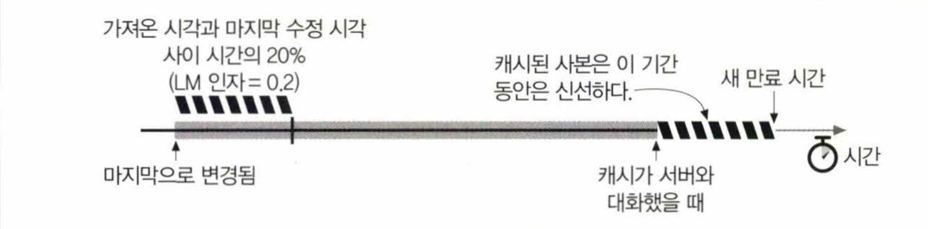

# 7.1 불필요한 데이터 전송

복수의 클라이언트가 자주 쓰이는 원 서버 페이지에 접근할 때 서버는 같은 문서를 클라이언트들에게 각각 한번씩 전송하게 됨.

- 똑같은 바이트들이 네트워크를 통해 계속 반복해서 이동하게 되므로 불필요한 데이터 전송이 발생함.
- 캐시는 이러한 불필요한 데이터 전송을 줄이기 위한 방법으로 사용됨.

# 7.2 데이터 병목

많은 네트워크가 원격 서버보다 로컬 네트워크에 더 넓은 대역폭을 제공함.
클라이언트들이 서버에 접근할 때 속도는, 그 경로에 있는 가장 느린 네트워크 속도와 같음.

- 만약 클라이언트가 빠른 LAN에 있는 캐시로부터 사본을 가져온다면, 캐싱은 성능을 대폭 개선할 수 있음.


# 7.3 갑작스런 요청 쇄도

많은 사람이 동시에 웹 문서에 접근할 때 트래픽 급증은 네트워크와 웹 서버에 심각한 장애를 야기함

- 캐싱은 자주 요청되는 문서를 원 서버로부터 한 번만 가져오게 하므로, 웹 서버에 대한 요청 쇄도를 줄일 수 있음.


# 7.4 거리로 인한 지연

거리가 멀어질수록 데이터 전송 속도는 느려지며, 모든 네트워크 라우터는 제각각 인터넷 트래픽을 지연시킴.

- 캐시를 통하면 원 서버로부터 데이터를 가져오는 대신, 더 가까운 캐시로부터 데이터를 가져옴에 따라 지연을 줄일 수 있음.


# 7.5 적중과 부적중

캐시에 요청이 도달했을 때 대응하는 사본이 있다면 적중(cache hit), 없다면 부적중(cache miss)이라고 함.


## 7.5.1 재검사(Revalidation)

원 서버 콘텐츠는 변경될 수 있기 때문에, 캐시는 반드시 그들이 갖고 있는 사본이 여전이 최신인지 서버를 통해 때때로 점검해야 함.
> 이를 **신선도 검사**(= 재검사)라고 함

캐시가 문서를 수백만개씩 갖고 있는 경우는 흔한데 비해 네트워크 대역폭은 부족하므로, 요청이 있을 때 해당 사본이 검사를 할 필요가 있을 정로도 오래된 경우에만 재검사를 실시함


### 재검사 적중

캐시는 사본의 재검사가 필요할 때 원서버에 작은 재검사 요청을 보낸 후 콘텐츠가 변경되지 않은 경우 서버는 아주 작은 304 Not Modified 응답을 보냄

- 캐시는 즉각 사본이 신선하다고 표시한 뒤 클라이언트에 해당 사본을 제공함
    - 이를 재검사 적중 혹은 느린 적중이라 부름

### 재검사 부적중

만약 콘텐츠가 변경되었다면, 서버는 새로운 콘텐츠와 함께 200 OK 응답을 보내고 캐시는 새로운 사본을 저장함

- 이를 재검사 부적중이라 부름

### 객체 삭제

만약 서버 객체가 삭제되었다면 404 Not Found 응답을 보내고 캐시는 해당 사본을 삭제함

## 7.5.2 적중률

캐시가 요청을 처리하는 비율을 캐시 적중률(= 캐시 적중비, 문서 적중비)이라 함

- 적중률은 예측하기 어려운 것으로 악명이 높지만, 오늘날 적중률 40%면 웹 캐시로 괜찮은 편임

## 7.5.3 바이트 적중률

모든 문서가 같은 크기는 아니기 때문에 단순히 문서 적중률이 모든 것을 말해주진 않음.

- 몇몇 객체는 덜 접근되지만 크기가 크기 때문에 전체 트래픽에는 더 크게 기여할 수 있음

바이트 적중률은 전체 트래픽 중 캐시로부터 제공된 바이트의 비율을 말함

- 해당 측정값은 캐시를 통해 트래픽이 절감된 정도를 포착할 수 있음
- 대역폭 절약을 최적화 하는데 유용한 지표로 사용될 수 있음

## 7.5.4 적중과 부적중의 구별

HTTP 클라이언트는 응답이 캐시 적중이었는지, 원서버 접근인지 알 수 있는 방법이 없음
> 두 경우 모두 HTTP 200 OK 응답이 떨어지기 때문

- 간접적으로 응답의 Date 헤더값을 현재 시각과 비교하여 이용하여 캐시 적중 여부를 판단할 수 있음
    - 만약 Date 값이 현재 시각보다 이전이라면 캐시 적중이었던 것으로 간주할 수 있음
    - 만약 Date 값이 현재 시각과 같거나 이후라면 원서버 접근이었던 것으로 간주할 수 있음

# 7.6 캐시 토폴로지

캐시는 한명의 사용자에게만 할당될 수도 있고, 수천명의 사용자들 간에 공유될 수 있음

- 전자를 개인 전용 캐시라 함
- 후자를 공용 프락시 캐시라 함

## 7.6.1 개인 전용 캐시

개인 전용 캐시는 많은 에너지나 저장공간을 필요로 하지않으므로 작고 저렴하며, 웹 브라우저의 경우 개인 전용 캐시를 내장하고 있음

## 7.6.2 공용 프락시 캐시

공용 캐시는 여러 사용자들이 공유하는 캐시로 특별한 종류의 공유된 프락시 서버임

- 공용 캐시는 자주 찾는 객체를 단 한번만 가져와 모든 요청에 대해 공유된 사본을 제공함으로써 네트워크 트래픽을 줄일 수 있음


## 7.6.3 프락시 캐시 계층들

작은 캐시에서 캐시 부적중이 발생했을 때 더 큰 부모 캐시가 그 '걸러 남겨진' 트래픽을 처리하도록 하는 계층을 만드는 방식이 합리적인 경우가 많음

- 캐시 계층이 깊은 경우 요청은 캐시의 긴 연쇄를 따라가게 됨, 프락시 연쇄가 길어질수록 중간 프락시는 현저한 성능저하가 발생할 것임


## 7.6.4 캐시망, 콘텐츠 라우팅, 피어링

몇몇 네트워크 아키택처는 단순 캐시 계층 대신 복잡한 캐시망을 구성하는 경우가 있음.

- 캐시망의 프락시 캐시는 복잡한 방법으로 서로 대화하여, 어떤 부모 캐시와 대화할 것인지, 아니면 우회해서 원서버로 바로 갈 것인지에 대해 동적으로 결정을 내림
- 한층 더 복잡한 캐시 사이에서는 그들의 캐시를 연결하여 서로를 찾아볼 수 있게 해줌, 이러한 선택적인 피어링을 지원하는 캐시를 형제 캐시라고도 함.

### 캐시망 안에서 콘텐츠 라우팅을 위해 설계된 캐시가 하는 일

- URL에 근거하여, 부모 캐시와 원 서버 중 하나를 동적으로 선택함.
- URL에 근거하여 특정 부모 캐시를 동적으로 선택함.
- 부모 캐시에게 가기 전에, 캐시된 사본을 로컬에서 찾아봄.
- 다른 캐시들이 그들의 캐시된 콘텐츠에 부분적으로 접근할 수 있도록 허용하되, 그들의 캐시를 통한 인터넷 트랜짓(Internet transit)은 허용하지 않음.
    - Internet transit: 트래픽이 다른 네트워크로 건너가는 것


# 7.7 캐시 처리 단계

웹 캐시의 기본적인 동작은 대개 단순함. 일반적으로 7단계로 이루어짐

## 7.7.1 단계 1: 요청 받기

캐시는 네트워크 커넥션에서의 활동을 감지하고, 들어오는 데이터를 읽어들임

- 고성능 캐시는 여러개의 들어오는 커넥션들로부터 동시에 데이터를 읽어들이고, 메시지 전체가 도착하기 전에 트렌젝션 처리를 시작함

## 7.7.2 단계 2: 파싱

요청 메시지를 여러부분으로 파싱하여 헤더 부분을 조작하기 쉬운 자료구조에 담음.

- 캐싱 소프트웨어가 헤더필드를 조작하기 쉽게 만듦

## 7.7.3 단계 3: 검색

URI를 알아내고 해당하는 로컬 사본이 있는지 검사함

- 상황이나 설정에 따라서 원 서버나 부모 프락시에서 가져오거나 혹은 실패를 반환함

## 7.7.4 단계 4: 신선도 검사

캐시가 일정 기간동안 문서의 사본을 보관하고 있다면, 그 사본이 여전히 신선한지 확인해야 함

## 7.7.5 단계 5: 응답 생성

캐시는 캐시된 서버 응답 헤더를 토대로 응답 헤더를 생성함.

- 캐시는 클라이언트에 맞게 이 헤더를 조정해야 하는 책임이 있음.
- 캐시는 캐시된 본문을 클라이언트에게 전달하기 전에 필요하다면 변형해야 함.
    - 클라이언트가 HTTP/1.1 응답을 기대하는 상황에서 서버가 HTTP/1.0을 반환한다면 캐시는 반드시 헤더를 적절하게 번영해야 함.
- 캐시 신선도 정보를 삽입해야 하며(Cache-Control, Expires, Last-Modified, ETag 등) 요청이 프락시 캐시를 거쳐갔음을 알려주기 위해 종종 Via
  헤더를 포함시킨다.
- 단, Date 헤더는 조정해선 안됨. (Date 헤더는 원 서버가 응답을 생성한 시각을 나타내기 때문)

## 7.7.6 단계 6: 전송

응답 헤더가 준비되면 캐시는 응답을 클라이언트에게 되돌려줌

## 7.7.7 단계 7: 로깅

캐시는 로그 파일과 캐시 사용에 대한 통계를 유지함. 각 캐시 트렌젝션이 완료된 후 캐시는 통계 캐시 적중과 부적중 횟수(그리고 다른 관련 지표들)에 대한 통계를 갱신하고 로그
파일에 요청 종류, URL 그리고 무엇이 일어났는지를 알려주는 항목을 추가함

- 가장 많이 쓰이는 캐시 로그 포맷은 Squid 로그 포맷과, 넷스케이프 확장 공용 로그 포맷이 있음

## 7.7.8 캐시 처리 플로 차트


# 7.8 사본을 신선하게 유지하기

HTTP는 어떤 캐시가 사본을 갖고 있는지 서버가 기억하지 않더라도, 캐시된 사본이 서버와 충분히 일치하도록 유지할 수 있게 해주는 단순한 메커니즘을 갖고 있음.

- HTTP는 이 단순한 메커니즘을 문서 만료와 서버 재검사라고 부른다.

## 7.8.1 문서 만료

HTTP는 Cache-Control과 Expires라는 특별한 헤더를 이용해 원 서버가 각 문서에 유효기간을 붙일 수 있게 함.


- 필요하다면 캐시는 서버와의 접촉 없이 사본을 제공할 수 있으나, 만료된 경우 반드시 서버와 문서에 변경된 것이 있는지 검사애햐 함

## 7.8.2 유효기간과 나이

서버는 응답 본문과 함께하는 HTTP/1.0+ Expires나 HTTP/1.1 Cache-Control: max-age 웅답 헤더를 이용해서 유효기간을 명시한다.

| 헤더                     | 설명                     |
|------------------------|------------------------|
| Cache-Control: max-age | 문서의 최대 나이를 정의함 단위는 초단위 |
| Expires                | 절대 유효기간을 명시함.          |

## 7.8.3 서버 재검사

캐시된 문서가 만료되었다고 해서 원 서버에 존재하는 문서와 항상 다르다고 할 수는 없음.
다만 해당 문서를 캐시가 제공하는 것을 계속 허용하기 위해서는, 캐시는 원 서버에 문서가 여전히 유효한지 재검사를 통해 물어볼 필요가 있음.

- 재검사 결과 문서가 여전히 유효하다면, 캐시는 그 문서를 계속 제공할 수 있음.
- 만약 문서가 변경되었다면, 캐시는 새로운 문서를 가져와 클라이언트에게 제공해야 함.
- 문서가 삭제되었다면, 캐시는 해당 문서를 삭제해야 함.

## 7.8.4 조건부 메서드와의 재검사

웹 서버는 조건인 참인 경우에만 문서를 제공하는 조건부 메서드를 제공함.

- 이 요청은 서버가 갖고 있는 문서가 캐시가 갖고 있는 것과 다른 경우에만 객체 본문을 보내달라고 하는 식이다.

캐시를 재검사 할때 가장 유용한 헤더는 `If-Modified-Since`와 `If-None-Match` 헤더임.

| 헤더                  | 설명                                     |
|---------------------|----------------------------------------|
| `If-Modified-Since` | 만약 문서가 주어진 날짜 이후로 수정되었다면 요청 메서드를 처리함.  |
| `If-None-Match`     | 캐시된 태그가 서버에 있는 문서의 태그와 다를 때만 요청을 처리한다. |

## 7.8.5 If-Modified-Since: 날짜 재검사

재검사 요청은 흔히 IMS 요청으로 리소스가 특정 날짜 이후로 변경된 경우에만 요청한 본문을 보내달라고 함.

- 문서가 주어진 날짜 이후로 변경되었다면, 참으로 GET 요청은 200 OK 응답을 캐시에게 반환함. (새 문서, 새로운 만료날짜, 그 외의 다른 정보 포함)
- 주어진 날자 이후에 변경되지 않았다면, 거짓으로 서버는 304 Not Modified 응답 메시지를 클라이언트에게 반환함. (본문은 보내지 않음)
    - 헤더들은 포함하지만, 갱신이 필요한 것만을 보내줌 예를 들어 Content-Type은 잘 변하지 않기 때문에 보내줄 필요가 없으며, 새 만료날짜의 경우 보통 보내주게 됨


## 7.8.6 If-None-Match: 엔티티 태그 재검사

최근 변경일시 재검사가 적절히 행해지기 어려운 상황이 다음과 같이 있음

- 일정 간격으로 배치를 통해 다시 쓰여지는 경우
    - 내용에는 아무 변화가 없으나 변경시각은 바뀜
- 철자나 주석의 변경과 같이 전 세계 캐시들이 그 데이터를 다시 읽어들이기에 사소한 변경의 경우
- 최근 변경일시를 정확하게 판별할 수 없는 경우
- 1초보다 작은 간격으로 갱신되는 문서를 제공하는 서버들의 경우, 1초의 정밀도는 충분하지 않을 수 있음

이러한 문제를 해결하기 위해 HTTP/1.1은 엔티티 태그를 이용한 재검사를 제공함.

퍼블리셔가 문서를 변경했을 때 그는 문서의 엔티티 태그를 새로운 버전으로 표현할 수 있음.

- 엔티티 태그가 변경되었다면 캐시는 새 문서의 사본을 얻기(GET)위해 If-None-Match 조건부 헤더를 사용할 수 있음


위 그림에서 만약 서버의 엔티티 태그가 변경되었다면 서버는 HTTP 200 OK 응답을 반환하고, 새로운 문서와 함께 새로운 엔티티 태그를 반환함.

## 7.8.7 약한 검사기와 강한 검사기

서버는 캐시된 사본을 무효화 시키지 않고 문서를 살짝 고치는 것을 허용하고 싶은 경우가 있음.

- HTTP/1.1은 비록 콘텐츠가 조금 변경되었더라도 "그 정도면 같은 것"이라고 주장할 수 있게 해주는 '약한 검사기'를 지원함
    - 중요한 부분이 변경된 경우 함께 변경됨.
    - 조건부 특정 범위 가져오기 같은 몇몇 동작은 약한 검사기로는 불가능하기 때문에 서버는 'W/'접두사로 약한 검사기를 구분함
- 강한 검사기는 콘텐츠가 바뀔때마다 바뀜


## 7.8.8 언제 엔터티 태그를 사용하고 언제 Last-Modified 일시를 사용하는가

HTTP/1.1 클라이언트는 서버가 엔터티 태그를 반환한 경우 반드시 엔터티 태그 검사기를 사용해야 하며, `Last-Modified` 값만을
반환했다면 `If-Modified-Since` 검사기를 사용할 수 있음.

- 원서버는 가능하다면 엔터티 태그 검사기를 보내야 하며, 이점이 있다면 강한 엔터티 태그 대신 약한 엔터티 태그를 보낼 수 있음.
- Last-Modified 값을 같이 보내는 것도 선호됨
- 캐시나 서버가 If-Modified-Since와 엔티티 조건부 헤더를 모두 받았다면, 요청의 모든 조건부 필드의 조건에 부함되지 않는 한 304 Not Modified 응답을
  반환해야 함

# 7.9 캐시 제어

HTTP는 문서가 만료되기 전까지 얼마나 캐시되게 할 것인지 설정할 수 있는 여러가지 방법을 정의함

## 7.9.1 no-cache와 no-store 응답 헤더

no-store와 no-cache 헤더는 캐시가 검증되지 않은 캐시된 객체로 응답하는 것을 막음

- `no-store`: 캐시는 응답을 저장하지 않아야 함
- `no-cache`: 캐시는 응답을 저장할 수 있으나, 캐시된 사본을 클라이언트에게 제공하기 전에 서버에 재검사를 요청해야 함

### Pragma: no-cache

본질적으로 `Cache-Control: no-cache`와 같은 의미를 갖음

- `Pragma: no-cache`는 HTTP/1.0에서 사용되었으며, `Cache-Control: no-cache`는 HTTP/1.1에서 사용됨
- 호환을 위해 `Pragma: no-cache`가 HTTP/1.1에 포함되어 있음

## 7.9.2 Max-Age 응답 헤더

`Cache-Control: max-age` 헤더는 캐시가 응답을 저장할 수 있는 시간을 초 단위로 명시함.

- `Cache-Control: s-maxage`는 `max-age`와 비슷하지만, 공용 캐시에만 적용됨

## 7.9.3 Expires 응답 헤더

더 이상 사요하지 않기를 권하는 Expires 헤더는 초단위의 시간 대신 실제 날짜를 사용함

- 신선도 수명의 근사값은 만료일과 생성일의 초 단위 시간차를 계산하여 얻을 수 있음.
- 몇몇 서버는 문서를 항상 만료되도록 하기 위해 `Expires: 0`을 사용하나 이는 위법임

## 7.9.4 Must-Revalidate 응답 헤더

`Cache-Control: must-revalidate` 헤더는 캐시가 만료된 문서를 클라이언트에게 제공하기 전에 반드시 서버에 재검사를 요청해야 함을 나타냄

- 만약 서버가 응답을 재검사할 수 없다면, 캐시는 504 Gateway Timeout 응답을 클라이언트에게 반환해야 함

## 7.9.5 휴리스틱 만료

응답이 `Cache-control: max-age` 헤더나 `Expires` 헤더 중 어느 것도 포함하지 않은 경우 캐시는 경험적인 방법으로 최대 나이를 계산함.

- 계산 결과 얻은 최대 나이 값이 24시간보다 크다면, Heuristic Expiration 경고 헤더가 응답 헤더에 추기되어야 함
    - 이 헤더를 사용자가 볼 수 있도록 하는 브라우저는 거의 없음
- 지나치게 커지는 것을 방지하기 위해 상한을 보통 1주일로 하지만, 보수적인 사이트는 하루로 설정하는 경우도 있음

### LM인자 알고리즘

문서가 최근 변경 일시를 포함하고 있다면 사용할 수 있음.

- 캐시된 문서가 마지막으로 변경된 것이 상당히 예전이면, 안정적이고 갑자기 변할 가능성은 크지 않으므로, 더 오래 보관하고 있어도 안전함
- 최근에 변경된 경우, 자주 변경될 것이라고 판단할 수 있기 때문에 짧은 기간만 캐시함



### 기본 신선도 유지기간

아무런 단서가 없는 경우 기본 신선도 유지기간을 설정함(보통 한시간이나 하루)

- 더 보수적인 캐시는 휴리스틱 문서들의 경우 신선도 0을 설정하여, 캐시가 클라이언트에게 데이터를 재공할때마다 신선도 검사를 강제함

## 7.9.6 클라이언트 신선도 제약

웹 브라우저는 새로 고침 시 Cache-control 요청 헤더가 추가된 GET 요청을 발생시켜서, 강제로 재검사하거나, 서버로부터 콘텐츠를 가져옴

아래는 Cache-Control 지시어를 요약한 것임

| 지시어                                                          | 설명                                            |
|--------------------------------------------------------------|-----------------------------------------------|
| Cache-Control: max-stale<br>Cache-Control: max-style = \<s\> | 만료된 문서를 허용함. 만료된 시간이 \<s\> 초 이내라면 캐시된 사본을 제공함 |
| Cache-Control: min-fresh = \<s\>                             | 캐시된 사본이 \<s\> 초 이상 신선하다면, 캐시된 사본을 제공함         |
| Cache-Control: max-age = \<s\>                               | 캐시된 사본이 \<s\> 초 보다 오래된 캐시된 문서를 반환할 수 없음       |
| Cache-Control: no-cache                                      | 캐시된 사본을 제공하기 전에 서버에 재검사를 요청함                  |
| Cache-Control: no-store                                      | 캐시는 응답을 저장하지 않아야 함                            |
| Cache-Control: only-if-cached                                | 캐시된 사본만을 제공함                                  |

## 7.9.7 주의할 점

문서 만료는 완벽한 시스템이 아님

- 퍼블리셔가 잘못해서 유효기간을 까마득한 미래로 설정한다면, 만료되기 전까지 어떤 변경도 캐시되지 않음

# 7.10 캐시 제어 설정

## 7.10.1 아파치로 HTTP 헤더 제어하기

아파치 웹 서버는 HTTP 캐시 제어 헤더를 설정할 수 있는 여러가지 메커니즘을 제공함.

- 많은 것들은 디폴트로 가능하지 않도록 되어 있어 사용하려면 활성화 시켜야 함

### mod_headers

해당 모듈은 개별 헤더들을 설정할 수 있게 해줌.

- 개별 HTTP 헤더를 설정할 수 있는 지시어를 이용해 아파치 설정 파일에 설정을 추가할 수 있음.
- 개별 콘텐츠에 헤더들을 연결시키기 위해 아파치의 정규식과 필터를 조합하여 사용할 수 있음.

```apache
<Files *.html>
  Header set Cache-control no-cache
</Files>
```

### mod_expires

해당 모듈은 적절한 만료 날짜가 담긴 Expires 헤더를 자동으로 생성하는 프로그램 로직을 제공함

```apache
ExpiresDefault A3600
ExpiresDefault MB6400
ExpiresDefault "access plus 1 week"
ExpiresByType text/html "modification plus 2 days 6 hours 12 minutes"
```

### mod_cern_meta

HTTP 헤더들의 파일을 특정 객체와 연결시켜줌.

- 해당 모듈을 켜면 제어하고자 하는 파일에 각각 대응하는 메타파일들을 생성하게 됨

## 7.10.2 HTTP-EQUIV를 통한 HTML 캐시 제어

HTML 2.0부터는 HTTP-EQUIV 메타 태그를 이용해 HTML 문서에서 HTTP 헤더에 대한 정보를 부여할 수 있음

```html

<HTML>
<HEAD>
    <TITLE>My Document</TITLE>
    <META HTTP-EQUIV="Cache-control" CONTENT="no-cache">
</HEAD>
...
</HTML>
```

- 원래 웹 서버에서 사용되도록 의도한 것으로 서버는 HTML에서 `<META HTTP-EQUIV>`태그를 파싱하여 HTTP 응답에 정해진 헤더를 삽입함
    - 안타깝게도 서버의 부하를 가중시키고 설정값이 정적이고, HTML을 제외한 다른 파일의 타입을 지원하지 않기 때문에 이 기능을 지원하는 웹 서버나 프락시는 거의 없음


# 7.11 자세한 알고리즘

해당 섹션에서는 캐시 만료 공식에 적나라한 세부사항에 대해 알아봄

## 7.11.1 나이와 신선도 수명

캐시된 문서가 제공하기에 충분히 신선한지 알려주려면, 캐시는 나이와 신선도 수명만 확인하면 됨

이를 perl로 작성하면 다음과 같음
```perl
$충분히_신선한가 = ($나이 < $신선도_수명);
```

## 7.11.2 나이 계산
응답의 나이는 응답이 서버에서 생성된(혹은 재검사 되었을) 때부터의 지금까지의 시간이다.
- 캐시는 응답이 캐시에 도착했을 때 Date나 Age 헤더를 분석해서 얼마나 오래된 것인지 알 수 있다. 

```perl
$나이 = $문서가_우리의_캐시에_도착했을_때의_나이 + $사본이_우리의_캐시에_머무른_시간;
```

- 모든 서버가 동기화된 시간을 갖고 있지는 않기 때문에, 캐시에서 온 응답의 나이를 알아내는 것은 어려움

### 겉보기 나이는 Date 헤더에 기반한다.
모든 컴퓨터가 똑같이 정확한 시간을 갖고 있지 않기 때문에, Date 헤더는 정확한 시간을 나타내지 않을 수 있음.
- 겉보기 나이는 이처럼 Date 헤더에 기반하여 계산됨

두 컴퓨터 시계 설정 차이로 인한 문제를 클록 스큐라고 함.
- 이 때문에 종종 겉보기 나이는 차이가 나며 심지어 음수값이 되기도 함

```perl
$겉보기_나이 = max(0, $응답을_받은_시각 - $Date_헤더값);
$문서가_우리의_캐시에_도착했을_때의_나이 = $겉보기_나이; 
```

### 점층적 나이 계산
HTTP/1.1은 동기화 된 시계가 존재하지 않는다는 문제대한 우회책으로 캐시를 통과할 때마다 그 장치들이 Age 헤더에 상대적인 나이를 더하도록 한다.
- 각 중간 애플리케이션은 자신의 내부 시계를 이용해서 쉽게 문서의 체류 시간을 계산할 수 있음
- 단 HTTP/1.1이 아닌 장치의 경우 Age 헤더를 인식하지 못하고, 헤더를 고치지 않거나 삭제해버리는 문제가 있을 수 있다.

```perl
$겉보기_나이= max(0, $응답을_받은_시각 - $Date_헤더값); 
$보정된_겉보기_나이 = max($겉보기_나이, $Age_헤더값); 
$문서가_우리의_캐시에_도착했을_때의_나이 = $보정된_겉보기_나이;
```

### 네트워크 지연에 대한 보상
캐시는 언제 문제를 요청했고 도착했는지를 알고 있기 때문에 계산한 전체 왕복시간을 더함으로써 네트워크 지연을 보수적으로 교정함
- 만약 오차가 있다면, 문서를 실제보다 오래되어 보이게 만들어서 불필요한 재검사를 하게 만듦

```perl
$겉보기_나이 = max(0, $응답을_받은_시각 - $Date_헤더값);
$보정된_겉보기_나이= max($겉보기_나이, $Age_헤더값);
$응답_지연_추정값 = ($응답을_받은_시각 - $요청을_보낸_시각);
$문서가_우리의_캐시에_도착했을_때의_나이 = $보정된_겉보기_나이 + $응답_지연_추정값);
```

## 7.11.3 완전한 나이 계산 알고리즘


## 7.11.4 신선도 수명 계산
어떤 문서의 신선도 수명은 문서가 특정 클라이언트에게 제공해주기에는 더 이상 신선하지 않게 될 때까지 얼마나 오랜 시간 동안 가져올 수 있도록 허용되는지 알려줌.
- 신선도 수명은 서버와 클라이언트의 제약조건에 의존함
- 서버는 문서가 얼마나 자주 변경되어 발행되는지에 대한 정보를 갖고 있을 수도 있음


## 7.11.5 완전한 서버 신선도 알고리즘
알고리즘이 명시되어 있으나, 해당 정리에서는 핵심적인 부분이 아니라 제외함
> 만약 궁금하다면 책의 222p를 참고

# 7.12 캐시와 광고
캐시는 일반적으로 원서버에 실제로 접근하지 않도록 하므로써 성능을 개선하고 트래픽을 줄임

## 7.12.1 광고 회사의 딜레마
많은 콘텐츠 제공자들이 광고를 통해 돈을 벎. 이러한 광고는 캐시와는 상반된 목적을 가지고 있음.
- 캐시는 원 서버가 실제 접근 횟수를 알 수 없게 숨길 수 있음.

## 7.12.2 퍼블리셔의 응답
오늘날 광고회사는 캐시가 광고 시청 수를 가로채지 못하도록 모든 종류의 '캐시 무력화'기법을 사용함. 그들은 CGI 게이트웨이를 통해 광고를 제공하고, 캐시가 이를 캐시하지 못하도록 함.
> CGI 게이트웨이는 캐시가 캐시할 수 없는 동적 콘텐츠를 제공하는 서버를 의미함
- 매 접근마다 광고 URL을 고쳐쓰므로써 캐시가 광고를 캐시하지 못하도록 함
- 이는 캐시의 긍정적인 효과를 감소시킴

절충안으로 모든 접근에 대해 원서버와 재검사하도록 캐시를 설정할 수 있다.
- 이는 매 접근마다 원서버에 캐시 적중이 있었음을 알리지만, 본문 데이터를 전송하지 않으므로써 캐시의 효율성을 유지할 수 있음
  - 트렌젝션은 느려짐

## 7.12.3 로그 마이그레이션
캐시는 모든 적중 로그를 유지할 수 있다. 캐시는 이 로그를 서버에게 나누어 줄 수 있기 때문에 몇몇 콘텐츠 제공자들은 캐시로그를 수동으로 처리해서 직접 건네줌
- 불행하게 적중 로그는 크기 떄문에 옮기기 어려움
- 인증, 프라이버시 이슈도 있음
- 광고 수익을 지원해주는 지원 인프라를 개발하기 위한 벤처 기업들도 있음

## 7.12.4 적중 측정과 사용량 제한
RFC 2227에서는 "HTTP를 위한 캐시 적중량 측정과 사용량 제한"을 정의함. 
- 이 프로토콜은 HTTP에 때때로 특정 URL에 대한 캐시 적중 횟수를 정기적으로 서버에게 돌려주는 `Meter`라고 하는 새 헤더를 추가함.
- 이 방법을 통해 서버가 캐시된 문서가 적중된 횟수에 대해 정기적인 업데이트를 받을 수 있음.

서버는 캐시가 서버에게 보고하기 전까지 문서를 제공할 수 있는 횟수나 처리 시간을 제어할 수 있음
- 이를 사용량 제한이라 하며, 원 서버에게 보고하기 전에 캐시된 리소스가 얼마나 자주 사용될 수 있는지 서버가 제어할 수 있게 됨

